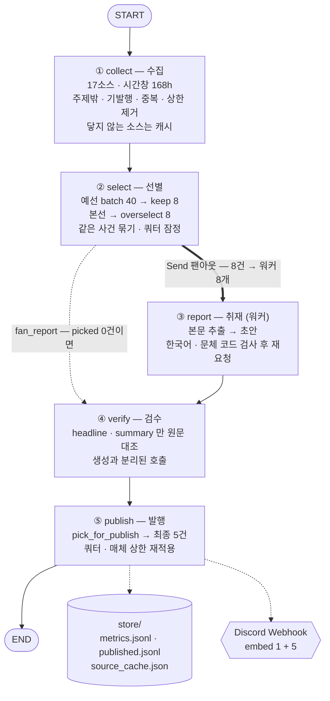
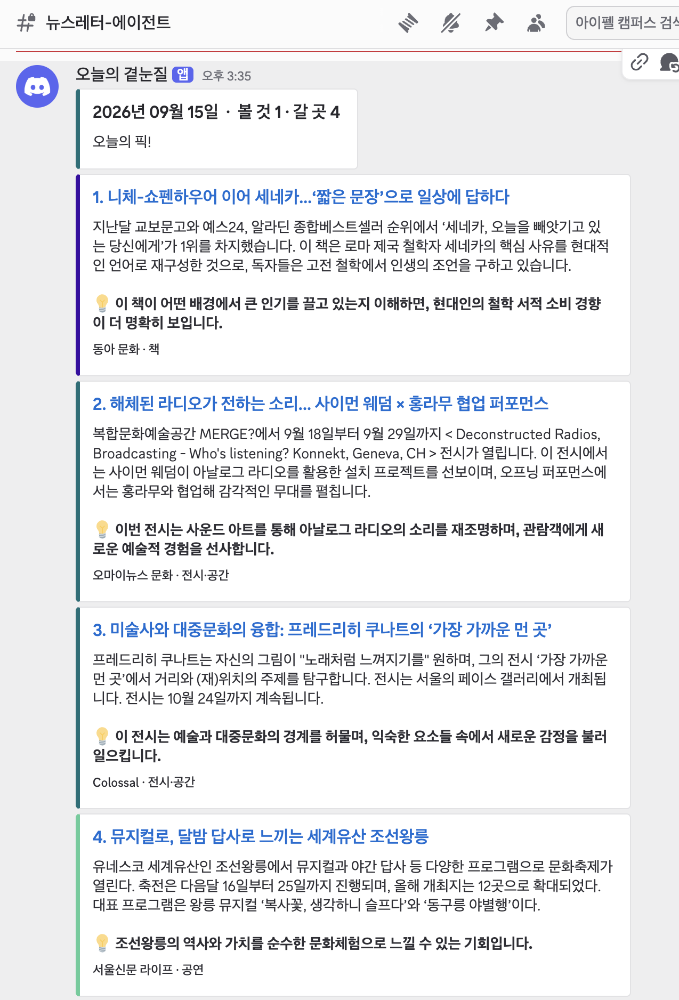

# 오늘의 곁눈질 — 뉴스레터 에이전트 보고서

> 매일 아침 9시 50분, 문화·공간 소식 400여 건을 읽고 다섯 건을 골라 디스코드로 보내는 에이전트입니다.
> 코드는 `graph.py` 한 파일, 실행은 `run.py`, 편집 방향은 `audience.yaml` 에 있습니다.

| | |
|---|---|
| 분야 | 문화 콘텐츠(OTT·영화·책) + 공간(전시·건축·**공연**) |
| 소스 | **17곳 — 국내 8 · 해외 9** (RSS 16 + 공공 API 1) |
| 파이프라인 | 수집 → 선별 → 취재 → 검수 → 발행 (LangGraph 노드 5개) |
| 쿼터 | 문화 2 · 공간 3 (최소 보장, 실측 비율에 맞춤) |
| 발행처 | Discord Webhook (embed 6개 = 리드 1 + 기사 5) |
| 이름 | **오늘의 곁눈질** — 정면(화제작)이 아니라 곁을 본다 |
| 누적 실행 | 28회 (`store/metrics.jsonl`) |

### 루브릭 항목별 근거가 있는 곳

| 루브릭 | 근거 | 어디에 |
|---|---|---|
| ① 수집 경로 3개 이상 | **17곳** — RSS 16 + 공공 API 1 (국내 8 · 해외 9) | 2절 채택표 |
| ① 소스 선택·탈락 기준의 타당성 | 관문 G1 본문 · G2 생존 · G3 접근 + 네 번째 축(무엇을 싣는가). 후보 110여 곳 실측 | 2절 · `settings.yaml` 묘지 · `source_audit.py` |
| ① 선별 기준의 정의 | `audience.yaml` 의 중요도 기준 6개 · 버릴 것 8개 — 전부 예/아니오로 답할 수 있는 형태 | 1절 · 3절 |
| ① **기준이 동작했다는 근거(수치·라벨)** | 깔때기 수치 · 쿼터 `n/m` · **채택 사유(`＋`)** · **토픽 라벨** · **중복 판정 라벨 수** · 탈락 사유(`−`) | 3-5절 · 5-1절 로그 · `store/metrics.jsonl` |
| ① 기준을 고칠 때의 근거 | 고정 입력 + 정답표 위에서 변형을 반복 측정한 비교 실험 3건 | 3-6·3-7절 · **`experiments/`** |
| ② 단순 요약을 넘은 인사이트 | `why` 칸 — "이걸 알면 무엇이 달리 보이는지" | 5-2절 발행물 |
| ② 할루시네이션 검수 | `check()` — 생성과 **분리된 호출**, `headline`·`summary` 만 원문 대조 | 5-4절 |
| ② 검수 실패 시 대안 | 그 건만 버리고 계속 진행 · 문체는 최대 2회 재요청 · 0건인 날도 발행 | 5-4절 층 표 |
| ③ 엔드투엔드 무오류 구동 | **실제 발행 회차** 전 구간 로그 · HTTP 204 · 디스코드 캡처 · **GitHub Actions 자동 실행** · 누적 28회 | 5-1 · 5-2 · 5-2-2 · 5-3절 |

---

## 1. 분야 및 독자 정의

### 왜 AI 뉴스에서 문화·공간으로 옮겼나

처음 만든 것은 AI 뉴스 브리핑이었습니다(`f4c1c85 문화·공간 브리핑으로 전환` 이전 커밋에 그대로 남아 있습니다). 두 가지 이유로 옮겼습니다.

1. **과제가 지정한 6개 소스와 겹칩니다.** 과제는 특정 AI 매체를 대상에서 제외하도록 정해 두었는데, AI 뉴스 도메인에서 그 여섯 곳을 빼면 사다리의 1·2칸이 거의 비어 버립니다.
2. **AI 뉴스는 "오늘 뭘 해야 하는가" 를 바꾸지 않는 날이 더 많습니다.** 반면 문화·공간은 독자의 행동(볼 것을 고른다 / 갈 곳을 정한다)과 직접 이어집니다. 뉴스레터가 읽히는 이유를 더 잘 설명합니다.

### 독자 (`audience.yaml`)

```yaml
독자:
  누구: "볼 만한 것과 가볼 만한 곳을 찾는 사람 — 화제작보다 덜 알려진 것을 선호"
  이미_아는_것: "주요 OTT 구독 중. 박스오피스·베스트셀러 상위권과 이미 화제인 작품은 알고 있음"
```

**"이미 아는 것" 을 따로 적은 이유**가 이 프로젝트의 중심입니다. 뉴스레터의 가치는 "중요한 것" 이 아니라 "이 사람이 아직 모르는데 알면 좋을 것" 입니다. 넷플릭스 주간 1위는 중요하지만 독자는 이미 압니다. 그래서 버릴 것 목록에 `"이미 화제인 작품의 또 다른 리뷰 — 넷플릭스 주간 1위, 베스트셀러 1위"` 가 들어 있습니다.

### 묶음 — '무엇' 이 아니라 '어떻게 접하는가'

```yaml
묶음설명:
  문화: "집이나 손 안에서 보고 읽는 것. 스트리밍·극장·책"
  공간: "직접 찾아가서 몸으로 겪는 것. 전시장·미술관·공연장·건축물"
```

국내 소스를 늘리며 **공연**을 토픽에 더했습니다(`월간 객석`). 공연은 "직접 가서 몸으로 겪는 것" 이라 전시·건축과 같은 *공간* 묶음입니다 — 기존 목록에는 전시장과 건축물은 있었는데 공연장이 비어 있었습니다.

데스크지침은 **일부러 "반드시" 를 쓰지 않았습니다.**

```yaml
- 이름: "공연"
  묶음: "공간"
  데스크지침: "공연 날짜와 공연장을 원문에 있는 대로. 출연자·지휘자·프로그램
              구성은 원문에 적힌 것만 쓸 것. 없으면 쓰지 말 것"
```

공연 기사는 프로그램 구성·출연진이 보도자료에만 있고 기사에는 없는 경우가 많습니다. 실제로 한 축제 기사에서 모델이 *'야간 답사'* 와 *'능침 특별 개방'* 을 지어내 검수에서 탈락했습니다(5-1절 로그). 6절의 러닝타임 사례와 같은 실패라, 같은 실수를 반복하지 않도록 처음부터 안전한 형태로 적었습니다.

묶음 이름만 주면 모델이 **"전시도 문화 아니냐"** 로 읽습니다. 실제로 그렇게 됐습니다 — 전시 기사 다섯 건이 전부 `문화` 로 들어와 공간 쿼터가 0건이 된 실행이 있었습니다. 그래서 묶음을 *행동* 으로 정의해 적었고, 최종적으로는 **모델에게 묶음을 묻지 않고 토픽에서 계산하는 쪽으로 바꿨습니다**(3절 참고).

### 중요도 기준을 쓸 때 지킨 두 규칙

- **기사 하나를 보고 예/아니오로 답할 수 있는 질문으로.** "좋은 기사인가" 는 답할 수 없습니다. "지금 실제로 볼 수 있거나 갈 수 있는가" 는 답할 수 있습니다.
- **추상어 말고 구체적으로.** 버릴 것에 "홍보성" 이라고 쓰면 모델마다 다르게 해석합니다. `"캐스팅·촬영 시작·제작 확정 등 아직 결과물이 없는 소식"` 처럼 셀 수 있게 적었습니다.

실제 중요도 기준 4개(우선순위 순):

1. 지금 실제로 볼 수 있거나 갈 수 있는가 — 스트리밍 중이거나, 상영 중이거나, 전시 기간 안인가
2. 어디서 볼 수 있는지가 글에 적혀 있는가 — 플랫폼 이름, 극장, 전시장
3. 덜 알려진 것인가 — 화제작·상위권이 아니라 묻혀 있던 것인가
4. 왜 볼 만한지 구체적인 근거가 있는가 — 연출·문장·공간에 대한 실제 묘사

---

## 2. 소스 채택표

### 관문 세 개

소스는 취향이 아니라 **통과/탈락이 갈리는 관문**으로 골랐습니다. `source_audit.py` 가 LLM 없이 결정론적으로 잽니다(결과는 `store/source_audit.json`).

| 관문 | 무엇을 보나 | 기준 |
|---|---|---|
| **G1 본문** | 원문 주소에서 본문이 추출되는가 | 평균 `min_body = 500자` 이상 |
| **G2 생존** | 7일 창 안에 기사가 있는가 | `in_window > 0` |
| **G3 접근** | 주소가 응답하는가 | HTTP 200 · `entries > 0` |

`min_body` 는 600 → 500 → **450** 으로 두 번 낮췄습니다. 기준을 소스에 맞춰 무르게 한 것이 아니라, **"본문이 있긴 한데 짧게 주는 매체" 와 "본문을 아예 안 주는 매체" 를 가르는 선이 어디인가**를 실측이 알려준 결과입니다.

| 값 | 왜 내렸나 | 경계에 있던 것 |
|---|---|---|
| 600 | 최초값 | — |
| 500 | ArchDaily 평균 585자 — 600이면 아슬아슬 | ArchDaily 585 |
| **450** | **국내 매거진은 본문이 짧다.** 해외 기준을 그대로 쓰면 국내 소스가 먼저 떨어진다 | 월간미술 452 · 동아 문화 1,094(최소 268) |

떨어진 쪽은 **0자**(Dezeen·RogerEbert·NYT Books·조선 문화)라 450 언저리에 몰려 있지 않습니다. 즉 이 관문은 여전히 "본문을 주느냐 마느냐" 를 가르지, 근소한 차이로 소스를 가르고 있지 않습니다.

한 가지 정정할 것이 있습니다. 450으로 낮추면 452자로 탈락했던 **월간미술이 되살아날 것으로 예상했는데, 실제로는 살아나지 않았습니다.** 다시 재 보니 7일 창 안에 기사가 0건(G2)이라, 본문 관문을 넘어도 쓸 수 없는 소스였습니다. 묘지에 적힌 사유(`본문 452자 (G1)`)가 실은 **첫 번째로 걸린 관문일 뿐 진짜 병목이 아니었던** 것입니다. `settings.yaml` 의 해당 줄을 고쳐 두었습니다.

### 채택 — 17곳 (2026-09-15 13:08 실측, 창 168h, 본문 표본 3건)

| 소스 | 방식 | 전체 | 7일 내 | 본문 성공 | 평균 본문 | 최소 본문 | 발행 기여(28회) |
|---|---|---:|---:|---:|---:|---:|---:|
| 문화포털 전시 | API | 7 | 7 | 3/3 | 7,033자 | 2,142 | **29건** |
| Colossal | RSS | 10 | 10 | 3/3 | 2,327자 | 1,932 | 20건 |
| 오마이뉴스 문화 | RSS | 20 | 20 | 3/3 | 2,998자 | 2,636 | 15건 |
| 경향 문화 | RSS | 50 | 50 | 2/3 | 1,055자 | 423 | 14건 |
| 동아 문화 | RSS | 50 | 50 | 2/3 | 1,094자 | 268 | 7건 |
| Guardian Books | RSS | 28 | 15 | 3/3 | 6,223자 | 5,139 | 6건 |
| 서울신문 라이프 | RSS | 28 | 28 | 3/3 | 2,267자 | 1,765 | 6건 |
| IndieWire | RSS | 12 | 12 | 3/3 | 5,537자 | 4,652 | 5건 |
| Designboom | RSS | 10 | 10 | 3/3 | 3,903자 | 2,669 | 5건 |
| 월간디자인 | RSS | 10 | 10 | 3/3 | 3,187자 | 1,641 | 5건 |
| ArchDaily | RSS | 24 | 24 | 3/3 | 585자 | 518 | 3건 |
| Guardian Art | RSS | 23 | 17 | 2/3 | 4,619자 | 377 | 3건 |
| LitHub | RSS | 10 | 10 | 3/3 | 3,438자 | 1,956 | 2건 |
| 월간 객석 | RSS | 8 | 4 | 3/3 | 4,430자 | 3,122 | 1건 |
| 독서신문 | RSS | 50 | 29 | 2/3 | 876자 | 286 | 1건 |
| WhatsOnNetflix | RSS | 50 | 50 | 3/3 | 6,467자 | 2,578 | 0건 |
| Decider | RSS | 10 | 10 | 3/3 | 3,597자 | 1,448 | 0건 |

### 탈락 — 15곳 이상 (`settings.yaml` 하단에 사유와 함께 남겨 둠)

다시 넣지 않도록 **탈락 사유를 코드 옆에 적어 두었습니다.**

| 소스 | 실측 | 걸린 관문 |
|---|---|---|
| **Dezeen** | 7일 50건으로 **물량 1위**, 본문 추출 **0자** | G1 |
| RogerEbert | 본문 추출 0자 | G1 |
| NYT Books | 본문 추출 0자 | G1 |
| Criterion | 본문 0자 + 7일 내 1건 | G1·G2 |
| 월간미술 | 본문 452자(450 기준 통과)이나 **7일 내 0건** | G2 |
| 한겨레 문화면 | 30건 **전량 날짜 없음** → 창 판정 불가 | G2 |
| 조선 문화 | 100건 중 94건이 창 안인데 **본문 0자** | G1 |
| 세계 문화 · 한겨레21 · 시사IN | 항목은 있으나 날짜 전량 없음 | G2 |
| 기획회의 · 스트리트H · 헤이팝 | 7일 내 0건 | G2 |
| 브리크 매거진 | 7일 내 0건, 발행이 뜸함 | G2 |
| 씨네21 · 네오룩 · MMCA · 아트맵 · VMSPACE · KOPIS · 채널예스 · 아트인컬처 · 아트바바 · 디자인정글 · 더뮤지컬 · 플레이디비 · 아르코 · KMDb · 노컷 · 한국일보 · 중앙 · 엘르 · 에스콰이어 · 톱클래스 · 예술경영 · 뉴스페이퍼 · 아트렉처 | 404 또는 `entries` 0 | G3 |
| 인디포스트 · 서울문화재단 | 403 | G3 |
| 퍼블릭아트 · 북즐라이프 · 행복이가득한집 · 럭셔리 | 접속 불가 | G3 |
| culture.go.kr 구 openapi | HTML 에러페이지, 폐기됨(진짜 키로도 동일) | G3 |
| api.kcisa.kr `API_CCA_1xx` | data.go.kr 키를 받지 않음 (전부 403) | G3 |
| 한국문화정보원_전시회정보(odcloud) | 2024년 전시 36건짜리 **정지된 스냅샷** — 진행 중 0건·링크 없음·장소 없음 | G1·G2 |
| 과제 지정 제외 6개 AI 매체 | — | 검토 대상에서 제외 (과제 지정) |

### 관문은 넘었는데 뺀 것들 — 네 번째 축

국내 비중을 늘리려고 후보 **110여 곳**을 재면서, G1~G3 와는 **다른 축**에서 떨어지는 소스들이 나왔습니다. 접근되고, 기사가 있고, 본문도 길게 주는데 — **싣는 내용이 이 뉴스레터의 것이 아닌** 경우입니다.

| 소스 | 관문 | 그런데 무엇을 싣나 | 어느 기준에 걸리나 |
|---|---|---|---|
| CJ뉴스룸 | 본문 1,504자 통과 | 협력사 대금 조기 지급 · CGV 9월 라인업 | **당사자 발표(tier1)** = 홍보물. `tier1_max: 0` |
| 연합 문화 | 120건, 물량 최다 | 공모 선정 · 협의회 출범 · 에미상 수상 불발 | 버릴 것 — 수상·발표·홍보 |
| 맥스무비 | 선필터 60% 통과 | 부고 · 박스오피스 50만 돌파 · 예능 민박 | 버릴 것 — 흥행 성적·연예 |
| 익스트림무비 | 15건 전부 창 안 | **캐스팅 확정 · 촬영 시작** | 버릴 것 — 결과물이 없는 소식 |
| 디에디트 | 본문 4,256자 | 아이폰 듀오 · 9월 신상 리스트 | 도메인 밖 — 가전·쇼핑 |
| 보그 · GQ · 마리끌레르 | 본문 1,200~1,700자 | 패션 · 뷰티 · 브랜드 협찬 이벤트 | 버릴 것 — 협업 상품 |
| 국민 문화 | 본문 2,183자 | 관광 할인 · 기관 인사 | 도메인 밖 |

**관문 세 개는 "쓸 수 있는가" 만 잽니다.** "쓸 만한가" 는 `audience.yaml` 의 버릴 것 목록이 잽니다. 두 가지를 섞어 한 관문으로 만들지 않은 것이 이 설계의 이점입니다 — 관문은 코드로 결정론적으로 돌고(`source_audit.py`), 내용 판단은 선별 단계의 언어 모델이 합니다. **CJ뉴스룸을 뺀 근거가 "본문이 짧아서" 가 아니라 "당사자 발표라서" 라고 말할 수 있는 것**이 그 덕분입니다.

### 국내 OTT 플랫폼 — 사다리 1·2칸이 통째로 비어 있다

"넷플릭스·디즈니플러스·티빙·웨이브에서 직접 가져올 것은 없는가" 를 실제로 확인했습니다.

| 대상 | 결과 |
|---|---|
| 넷플릭스 뉴스룸 (ko · en) | 404 |
| 티빙 | 404 |
| 웨이브 | `entries` 0 |
| 키노라이츠 · 왓챠 블로그 | 접속 불가 |

**국내 OTT 는 RSS 를 내지 않습니다.** 게다가 설령 있었더라도 이 설계에서는 쓰지 않았을 것입니다 — 플랫폼 공식 발표는 **당사자 발표(tier1)** 이고, 이 분야에서 tier1 은 곧 홍보물이라 `tier1_max: 0` 으로 막아 두었기 때문입니다.

그리고 이 범주에 대한 실증이 이미 있습니다. 넷플릭스 신작 정보는 **`WhatsOnNetflix`(2칸 매체)로 이미 들어오고 있고, 그 소스의 발행 기여는 14회 동안 0건**입니다. 신작 공지는 "이미 화제인 것" 이거나 "아직 볼 수 없는 것" 이라 중요도 기준 1·3번에서 떨어집니다. **가져올 경로가 없었을 뿐 아니라, 있었어도 발행되지 않았을 것**이라는 뜻입니다.

### 이 표에서 읽어야 할 것

**① 물량이 아니라 사용 가능성으로 고릅니다.**
Dezeen 은 7일 50건으로 후보 중 물량 1위였습니다. 그런데 본문 추출이 0자라 **취재 단계에서 100% 탈락**합니다. 수집 숫자만 늘리고 발행에는 한 건도 기여하지 못하는 소스입니다. 탈락시켰습니다.

**② 관문 통과와 기여도는 다른 것을 잽니다.**
WhatsOnNetflix 는 7일 50건 · 본문 평균 6,467자로 지표가 가장 좋은 축인데 **28회 동안 발행 0건**입니다. 넷플릭스 신작 공지는 "이미 화제인 것" 과 "아직 볼 수 없는 것" 이라 중요도 기준 1·3번에서 떨어집니다. 관문은 *쓸 수 있는가*, 기여도는 *쓸 만한가* 를 잽니다. `report_card.py` 가 후자를 매 실행 쌓아 두고, 몇 주째 0이면 목록에서 빼라고 표시합니다.

**③ 사다리를 한 칸 올라간 소스가 1등입니다.**
국내 전시는 **RSS 가 없습니다**. 매체 RSS(2칸)로는 못 구해서 공공 API(1칸, 문화포털 `cultureinfo`)까지 올라갔고, 그 소스가 오래 발행 기여 1위였습니다. 대신 대가가 있습니다 — GitHub Actions 러너에서는 이 주소에 닿지 않습니다(로컬 0.9초 성공 / 러너 ConnectTimeout 30초 × 3회).

**"해외라서" 는 아니었습니다.** 처음에는 그렇게 적어 두었는데, 확인해 보니 틀렸습니다.

| 확인한 것 | 결과 |
|---|---|
| `AAAA` 레코드(IPv6) | 없음 → IPv6 경로 문제가 아니다 |
| `A` 레코드 | `27.101.236.63` 하나뿐 |
| 국내가 아닌 다른 네트워크에서 호출 | **HTTP 401 응답** → 연결 자체는 된다 |

즉 전면 해외 차단이 아니라 **러너가 쓰는 대역(Azure)이 막히는 것**입니다. `data.go.kr` 은 서비스별 IP 등록·차단(`UNREGISTERED_IP_ERROR 32` · `BLACKLIST_IP_ACCESS_ERROR 29`)을 두는데, 러너 IP 는 매번 바뀌어 등록으로는 풀 수 없습니다.

**그래서 캐시로 풉니다.** 국내에서 돌릴 때 받은 결과를 `store/source_cache.json` 에 남기고, CI 는 API 대신 그것을 읽습니다. 전시는 몇 주씩 열리므로 하루 이틀 지난 목록도 쓸 만합니다 — **도메인 특성이 해법을 싸게 만들어 준 경우**입니다.

캐시 설계에서 한 가지를 의도적으로 하지 않았습니다. **항목의 시각을 새로 찍지 않습니다.** 받은 때를 그대로 두므로, 캐시가 시간 창(168h)보다 오래되면 수집 단계에서 저절로 전부 탈락합니다. 유효기간 설정도, 만료 검사 코드도 필요 없습니다 — *이미 있는 관문이 캐시에도 그대로 걸리게 두면 됩니다.* 캐시를 썼다는 사실과 나이는 `· 캐시 사용: 문화포털 전시 0.4일 전 7건` 으로 로그에 남습니다. 신선한 척하지 않습니다.

**④ 국내 종합지 넷은 선필터 없이는 못 씁니다.**
국내 종합 문화면은 절반이 연예·가요·부고입니다. LLM 을 부르기 전에 **비용 0의 결정론적 문자열 검사**로 좁힙니다(`filters.pick` 27개 키워드). 실측 로그 한 줄:

```
· 선필터: 경향 문화 -18, 동아 문화 -31, 서울신문 라이프 -17, 오마이뉴스 문화 -13
```

**매 실행 79건이 예선에 들어가기도 전에 빠집니다.** 이 79건이 그대로 들어왔다면 예선 묶음이 두 개 더 늘고, 그만큼 LLM 호출과 토큰을 쓰고도 버려졌을 것입니다. 국내 비중을 늘리면서 선필터가 선택이 아니라 **전제 조건**이 됐습니다.

**⑤ 국내 쪽에 무게를 실었습니다.**
독자가 실제로 갈 수 있는 곳은 국내입니다. 그런데 초기 목록은 해외 9 · 국내 3 이었습니다 — 영어권 매체가 RSS 를 잘 내기 때문이지, 독자에게 더 쓸모 있어서가 아니었습니다. 후보 **110여 곳**을 재서 국내 5곳을 더했습니다(**국내 8 · 해외 9**).

| 추가 | 성격 | 창 안 | 본문 | 선필터 |
|---|---|---:|---:|---|
| 월간 객석 | 공연예술 전문 매거진 | 8 | 4,430자 | 불필요 |
| 독서신문 | 책 전문지 | 50 → 29 | 876자 | **일부러 안 검** |
| 동아 문화 | 종합지 문화면 | 50 → 19 | 1,094자 | 필요 |
| 서울신문 라이프 | 종합지(문화 전용 RSS 없음) | 26 → 9 | 2,267자 | 필요 |
| 오마이뉴스 문화 | 시민기자 — "덜 알려진 것" 성향 | 20 → 7 | 2,998자 | 필요 |

**월간 객석은 공연을 데려옵니다.** 공연은 "직접 가서 몸으로 겪는 것" 이라 묶음상 *공간* 에 속합니다 — 기존 목록에 전시·건축은 있었지만 공연이 비어 있었습니다.

**독서신문에는 선필터를 일부러 걸지 않았습니다.** 걸어 보니 29건 중 11건이 떨어지는데, 그중에 `[신간] 『전쟁은 어떻게 정의를 훔쳤을까?』` 같은 **정상 신간 소개 3건**이 섞여 있었습니다. 제목에 '책·도서' 라는 낱말이 없었기 때문입니다. 종합지에는 필수인 장치가 **전문지에는 역효과**입니다 — 선필터는 "주제 밖을 쳐내는 것" 이지 "주제를 확인하는 것" 이 아니기 때문입니다. 물량은 `per_source_max: 6` 이 이미 막고 있습니다.

**⑥ 문화가 공간에 밀립니다 — 소스를 늘려도 그대로입니다.**
`report_card.py` 의 누적 기여를 묶음별로 갈라 보면 비대칭이 뚜렷합니다.

| 묶음 | 전용 소스 | 누적 발행 | 소스당 |
|---|---:|---:|---:|
| 공간 (전시·건축·공연) | 7곳 | **40건** | 5.7 |
| 문화 (OTT·영화·책) | 6곳 | **13건** | 2.2 |

소스 수는 비슷한데 기여가 **3배** 차이 납니다. 원인은 중요도 기준에 있습니다 — 1번 *"지금 실제로 볼 수 있거나 갈 수 있는가"* 와 2번 *"어디서 볼 수 있는지가 글에 적혀 있는가"* 는 **전시 기사가 구조적으로 잘 만족합니다.** 전시 기사에는 기간과 장소가 거의 항상 적혀 있으니까요. 반면 영화·OTT 기사는 신작 공지(아직 볼 수 없음)나 리뷰(어디서 볼지 안 적힘)가 많습니다.

`WhatsOnNetflix` 와 `Decider` 가 **둘 다 17회 누적 0건**인 것이 같은 이야기입니다. 이건 소스가 나쁘다기보다 **기준이 의도대로 작동하는 증거**입니다 — "지금 갈 수 있는 전시" 가 "다음 달 공개될 시리즈" 를 이기는 것은 이 독자에게 맞는 결과입니다.

**⑧ 목록형 소스의 후보 상한을 따로 낮췄습니다 (6 → 3).**

`문화포털 전시` 는 여유분 적용 후 13회에서 **발행분의 27% 를 차지해 1위**였습니다. 발행분 매체 상한(2건)이 이미 걸려 있는데도 그렇습니다 — 후보 단계에서 6건까지 들어와 본선 자리를 많이 가져가기 때문입니다.

문제는 양이 아니라 **재료의 성격**입니다. 이 소스는 행사 DB 라 원재료가 *목록 레코드* 입니다. 기간·장소는 정확하지만 비평이 없어, 요약이 안내문으로 나옵니다. 교양 쪽으로 기준을 옮겨도 **없는 맥락을 프롬프트로 만들 수는 없습니다.**

그래서 `Source` 에 `max_items` 를 두어 이 소스만 후보 상한을 3으로 낮췄습니다. 빼지는 않았습니다 — 국내 전시를 가진 유일한 소스이고, 그중 기획전은 맥락이 있기 때문입니다. 실제로 상한을 낮춘 뒤 올라온 두 건은 `《강주현: 연결의 비정형》`(유휴공간을 다시 보는 기획)과 `ACC 《아시아의 장치들》`('받아쓰기-재현하기-다시쓰기')로, **목록 중 맥락이 있는 쪽이 남았습니다.**

*상한은 나쁜 소스를 벌하는 장치가 아니라, 다른 소스가 겨룰 자리를 만드는 장치입니다.*

**⑦ 그래서 쿼터를 실측에 맞췄습니다 (문화 3·공간 2 → 문화 2·공간 3).**

쿼터는 **최소 보장**이지 상한이 아닙니다. 그러니 이 값은 *바라는 비율* 이 아니라 **이만큼은 실제로 채울 수 있는 양**으로 잡아야 합니다. 여유분 적용 후 10회 실측:

| | 문화 | 공간 |
|---|---:|---:|
| 회차 평균 발행 | 1.7건 | 2.9건 |
| 누적 발행 | 17건 (37%) | 29건 (63%) |
| 쿼터 충족 | **2/10회** | 9/10회 |

문화 3 은 **10회 중 8회가 미달**이었습니다. 소스를 12곳에서 17곳으로 늘려도 비율은 그대로였습니다 — 앞에서 본 대로 소스를 더해서 풀리는 문제가 아니기 때문입니다.

**늘 미달로 남는 목표는 신호를 주지 못합니다.** 매 회차 `문화 1/3` 이 찍히면, 그게 이상한 날인지 보통 날인지 구분되지 않습니다. 실측 비율(2:3)에 맞추면 미달이 다시 *예외* 가 되고, 그때 비로소 로그가 경고가 됩니다.

바꾸고 나서 곧바로 `문화 2/2 · 공간 2/3` 인 회차가 나왔습니다 — 이번엔 **공간 쪽이 모자란 날**이었고, 그 사실이 로그에 드러납니다. 문화 3 이었다면 `문화 2/3 · 공간 2/2` 로 찍혀 엉뚱한 쪽을 가리켰을 것입니다.

값을 치르는 부분도 적어 둡니다. 문화 후보가 넉넉한 날에는 보장 자리가 하나 줄어 **문화가 한 건 덜 들어갈 수 있습니다.** 다만 그런 날은 10회 중 2회였고, 그때도 남은 자리는 순위대로 채워지므로 문화가 좋으면 어차피 들어옵니다.

---

## 3. 선별 로직 설계

### 3-1. 왜 독립 채점이 아니라 상대평가인가

**개수가 고정된 문제는 채점 문제가 아니라 정렬 문제입니다.**

기사마다 0~10점을 매기는 방식을 먼저 생각했지만, 5건을 골라야 하는 상황에서는 쓸 수 없습니다. 독립 채점은 동점이 몰립니다 — 7점이 열두 건 나오면 **다섯 번째에서 자를 근거**를 주지 못합니다. "중요한 순서대로 최대 k건" 으로 물으면 모델이 한 화면에 놓고 견주므로 순위 자체가 답이 됩니다.

### 3-2. 왜 한 번에 다 안 넣고 예선 → 본선인가

후보는 매 실행 **99건 안팎**입니다(국내 소스를 더하기 전에는 71건이었습니다). 한 번에 다 넣으면 두 가지가 나빠집니다.

- **판단이 흔들립니다** — 목록이 길수록 앞뒤 항목에 따라 같은 기사의 평가가 달라집니다
- **토큰만 씁니다** — 70건의 제목을 전부 주고 5건을 받는 것은 낭비입니다

그래서 `batch: 40` 씩 잘라 예선을 돌리고(`prelim_keep: 8`), 통과분 16건을 모아 본선을 돌립니다. 40은 "한 화면에서 견줄 수 있는 크기" 로 잡은 값입니다. 예선 묶음끼리는 서로를 모르므로 **묶음 운**이 생기는데, 통과 수를 목표(5)보다 넉넉한 8로 둬서 줄였습니다.

실측 통과율: **99건 → 예선 20건 → 본선 8건 → 발행 5건 (약 8%)**

소스를 17곳으로 늘리자 예선 묶음이 2개에서 **3개**로 늘었습니다(`40 + 40 + 19`). 예선 LLM 호출이 한 번 더 늘어난 값을 치르고, 그 대신 국내 기사가 후보에 들어옵니다.

### 3-3. 왜 5건이 아니라 8건을 뽑는가 — 이번에 고친 것

**문제(실측)**: 쿼터는 `select()` 에 걸려 있는데, 그 뒤 `verify()` 가 건수를 **줄입니다**. 앞에서 문화 3 · 공간 2(당시 쿼터)를 맞춰 놓아도, 검수가 그중 몇 건을 떨어뜨리면 발행 시점에는 배분이 이미 깨져 있습니다.

`store/metrics.jsonl` 의 적용 전 7회 전부입니다 (당시 쿼터 문화 3 · 공간 2, 목표 5건):

| 회차 | 발행 | 묶음 | 매체 | 무엇이 깨졌나 |
|---|---:|---|---|---|
| 16:11:56 | 5 | 건축·디자인 2 · OTT 1 · 예술 2 | Colossal 2 | 묶음 라벨 자체가 흔들림 |
| 16:12:49 | 3 | 공간 2 · 문화 1 | — | 목표 미달 |
| **16:30:30** | **2** | 공간 2 · **문화 0** | **Designboom 2** | **한 묶음이 통째로 빔** |
| **16:41:01** | **2** | 문화 2 · **공간 0** | **문화포털 전시 2** | **반대쪽이 통째로 빔** |
| 16:42:29 | 4 | 공간 1 · 문화 3 | **IndieWire 3** | 한 매체가 절반 넘게 차지 |
| **16:43:53** | **3** | 문화 3 · **공간 0** | 문화포털 전시 2 | **또 한 묶음이 빔** |
| 10:24:06 | 3 | 공간 2 · 문화 1 | — | 목표 미달 |

**7회 중 목표 5건에 닿은 것은 1회뿐이고, 한 묶음이 통째로 빈 것이 3회입니다.** 16:30 과 16:41 은 연속한 두 회차인데 비는 쪽이 서로 반대입니다 — 어느 한쪽으로 기우는 편향이 아니라, **보장이 걸린 자리가 틀렸다**는 신호입니다.

**보장은 결과가 정해지는 자리에서 걸어야 합니다.** 앞에서만 걸면 뒤에서 무너집니다.

고친 방식:

- `overselect: 8` — 선별은 목표(5)가 아니라 **여유분 8건**을 뽑습니다. 실측 검수 탈락률 30~40% 를 메우는 크기입니다
- `max_per_source: 2` — **발행분 기준** 매체 상한입니다. 후보 상한(`per_source_max: 6`)과는 거는 자리가 다릅니다
- `pick_for_publish(verified)` — 발행 직전에 **2단계**로 확정합니다. 1차에 묶음 쿼터를 채우고, 2차에 남은 자리를 순서대로 메웁니다. 쿼터는 **최소 보장(하한)** 이지 상한이 아닙니다 — 한쪽이 모자란 날에는 다른 쪽이 그 자리를 가져갑니다
- 탈락분은 사유와 함께 `⑤ 발행` 로그에 남습니다

**치르는 값**: 취재·검수가 5건 → 8건이라 **LLM 호출이 약 1.6배**입니다. 실측 실행 시간 38~59초. 배분이 깨진 브리핑을 보내는 것보다 싸다고 판단했습니다.

지표에 `quota_dropped` (= 검수 합격 − 실제 발행) 를 새로 기록해, 여유분 8이 적절한지 되짚을 수 있게 했습니다.

### 3-4. 부탁을 코드로 바꾼 자리들

**프롬프트에 적은 것은 요청이지 보장이 아닙니다.** 출력만 보고 확인할 수 있는 규칙은 전부 코드로 옮겼습니다.

| 지시 | 프롬프트만 두면 | 코드로 어떻게 |
|---|---|---|
| "같은 사건은 하나만" | 같은 전시를 다룬 두 기사가 둘 다 들어온다 | `select()` 가 `event` 라벨을 세고 중복을 떨어뜨린다 |
| "묶음은 문화/공간 중 하나" | 전시 기사 5건이 전부 '문화' 로 들어왔다 | 모델에게 **묻지 않는다**. 구체적인 `topic` 만 묻고, 묶음은 `audience.yaml` 에서 계산한다 (`group_of`) |
| "한국어 '~합니다'체로" | 영어로 오거나 평서체로 온다 | `report()` 가 한글 포함 여부와 문장 끝을 검사하고 최대 2회 재요청, 못 고치면 로그에 남긴다 |
| "토픽은 이 여섯 중 하나" | '전시·공간' 대신 '전시' 가 와서 색이 기본값으로 떨어졌다 | 구조화 출력 스키마에 `enum` 으로 못박는다 |
| 모델이 범위 밖 번호를 준다 | 조용히 IndexError | `ask_picks()` 가 `0 <= index < len` 으로 거른다 |

**`event` 라벨을 좁게 정의한 이유**도 실측입니다. 처음에는 라벨 설명이 넓어서, 서로 다른 건축물 두 건이 `건축 디스플레이` 하나로 묶여 한 건이 잘렸습니다. 지금은 *"작품·전시·책 하나를 식별하는 고유한 이름. 장르나 분야가 아니다"* 로 못박았습니다.

**`topic` 에 default 를 주지 않은 이유**: 기본값을 주면 구조화 출력에서 '선택 필드' 가 되어 모델이 통째로 생략합니다. 필수로 두고 `enum` 으로 값을 고정했습니다.

### 3-6. 탈락 사유를 받아내기 — 비교 실험

모델이 스스로 떨어뜨린 기사 목록(`Shortlist.drops`)이 **사유 없이 제목만** 돌아오고 있었습니다. 스키마 설명에는 `"눈에 띄게 떨어뜨린 기사와 그 이유"` 라고 적혀 있는데도요.

이 프로젝트는 이미 같은 자리에서 한 번 데었습니다 — 검수 프롬프트를 '개선' 하려다 오탐을 0/3 → 3/3 으로 만든 일(6절 ③)입니다. 그래서 **고쳐 보기 전에 고정된 입력 위에서 비교**했습니다. 같은 후보 21건에 세 변형을 **각 6회**씩 돌렸습니다.

| 변형 | 무엇을 바꿨나 | drops | 사유 포함 | 비율 |
|---|---|---:|---:|---:|
| **A 현행** | `list[str]`, 설명만 "기사와 그 이유" | 49 | ~0 | **≈0%** |
| **B 설명 강화** | `list[str]`, 형식을 못박음 `「제목」 — 이유` | 29 | 1 | **3%** |
| **C 스키마 강제** | `list[Drop]`, `reason` 을 **필수 칸**으로 | 42 | 42 | **100%** |

A 의 실제 출력은 `(경향 문화) 한강·하루키 책 낸 문학동네…` 처럼 **출처와 제목뿐**입니다. (첫 집계에서 A 를 21건으로 셌는데, 제 판정 함수가 `(경향 문화)` 같은 출처 접두어를 사유로 오인한 것이었습니다 — 원문을 눈으로 보고 정정했습니다.)

**B 가 A 보다 나빠진 것이 이 실험의 수확입니다.** 형식을 자세히 지시하자 모델은 사유를 채우는 대신 **목록 자체를 줄였습니다**(49건 → 29건). 검수 프롬프트 때와 같은 패턴입니다 — *지시를 늘리면 모델은 지시를 따르는 대신 그 일을 덜 합니다.*

C 의 출력은 이렇습니다.

```
[5] 시상식 관련 보도이며 이미 화제작이므로 독자들에게 새롭지 않습니다.
[7] 수상자 명단만 나열된 내용으로 심층 분석이 없습니다.
```

`audience.yaml` 의 버릴 것 중 "시상식 수상·후보 발표" 와 "이미 화제인 작품" 에 정확히 대응합니다.

**품질이 상하지 않았는지도 함께 쟀습니다** — 이게 검수 프롬프트 사고에서 얻은 교훈입니다. 18회 전부에서 범위 밖 번호 0건 · 토픽 enum 위반 0건 · `why` 누락 0건이었고, 응답 시간도 C 가 평균 7.5초로 A(8.5초)보다 빨랐습니다.

*확인할 수 있는 것은 부탁하지 말고 칸으로 만들어야 합니다.* 이 프로젝트가 `topic` 에 `enum` 을 박고 한국어·문체를 코드로 검사한 것과 같은 이야기이고, 이번에는 **비교 실험으로 그 값을 재 두었습니다.**

### 3-7. 같은 사건 묶기 — 두 번째·세 번째 비교 실험

**먼저 바꾸려다 그만둔 것.** 어느 회차에서 모델이 에미상 기사 3건을 채택했습니다(`버릴_것` 1순위). 본선에 `OVERSELECT × 2 = 16`건을 요청하니 **자리를 채우려 바닥을 긁는다**고 의심했습니다. 같은 후보 21건 위에서 K 를 바꿔 재 봤습니다.

| K | n | 쿼터 충족 | 문화 평균 | 위반이 발행 후보까지 |
|---:|---:|---:|---:|---:|
| **16 (현행)** | 15 | 47% | 1.33 | **0.07** |
| 12 | 10 | 60% | 1.30 | 0.20 |
| 10 | 10 | 60% | 1.50 | 0.00 |
| 8 | 15 | 33% | 1.07 | **0.07** |

**가설이 틀렸습니다.** K=16 이 위반을 늘린다는 근거가 없고(K=8 과 같은 0.07), 오히려 8까지 낮추면 쿼터 충족이 47% → 33% 로 떨어집니다. 16·12·10 의 차이는 이 표본에서 노이즈 범위입니다. **그래서 바꾸지 않았습니다.** 에미상 3건은 단일 회차 변동이었고, 검수가 그중 2건을 잡았습니다.

> 이 실험에서 제 계측 스크립트가 반복문을 모듈 최상위에 둬서 `import` 할 때마다 다시 돌았고, 중간 요약의 `n` 표기가 어긋났습니다. 한때 "K=8 이 2/10" 으로 찍혔는데 개별 행을 세면 5/10 이었습니다. **중간 요약만 봤으면 반대 결론을 낼 뻔했습니다.** 화면에 찍힌 행을 전부 다시 모아 집계한 것이 위 표입니다.

**대신 진짜 결함이 드러났습니다.** 실험 지표에 "같은 사건 쌍이 같은 라벨을 받았는가" 를 넣어 뒀는데 계속 실패했습니다. 고정 후보에는 같은 사건을 다룬 쌍이 둘 있습니다 — (5,6) 성난사람들2 에미상(경향·동아), (10,11) 문학동네 매각(경향 2건).

```
[10] 문학동네                    [11] 문학동네 지분 매물          → 다름 ❌
[10] 매물로 나온 문학동네, …        [11] 한강·하루키 책 낸 문학동네, … → 제목 통째 ❌
```

**라벨이 갈려 둘 다 통과합니다.** 코드 주석은 *"라벨이 넓으면 다른 작품이 한 덩어리로 묶여 잘린다"* 를 경고하고 있었는데, 실제로 일어난 것은 **반대 방향**이었습니다.

세 변형을 각 5회씩 비교했습니다.

| 변형 | 정답쌍 기회 | 병합 | 병합률 | 오병합 |
|---|---:|---:|---:|---:|
| A 현행 | 2 | 0 | **0%** | **66** |
| B 라벨 설명을 조인다 | 0 | 0 | 측정 불가 | 0 |
| **C 코드로 한 번 더 본다** | 2 | 2 | **100%** | **0** |

**A 의 `오병합 66` 이 이 실험의 수확입니다.** 그 회차는 12건을 골랐는데 **12건 전부에 같은 라벨**이 붙었습니다(12개 중 2개를 뽑는 조합이 정확히 66). 실제 파이프라인이었다면 중복 제거가 11건을 버리고 **1건만 발행**했을 것입니다. 주석이 경고하던 실패가 드물게 실제로 일어납니다.

그래서 두 가지를 넣었습니다.

- **근접 중복 검사** — 제목에서 희귀한 낱말(후보 3개 제목 이하에만 나오는 것)을 3개 넘게 공유하면 같은 사건으로 본다. 고정 후보의 210개 쌍 전부에 돌려 **정답 2쌍만 검출, 오검출 0** 을 확인하고 임계값을 정했습니다. 글자 단위 유사도도 재 봤는데 영문 제목끼리 오검출이 32건 터져 버렸습니다 — 낱말 단위로 가야 했습니다.
- **넓은 라벨 방어** — 한 라벨이 `LABEL_MAX`(3)건을 넘게 덮으면 작품 이름이 아니라 분야 이름으로 보고 **제목으로 되돌립니다.** 12건이 1건이 되는 사고를 막습니다.

*확인할 수 있는 것은 부탁하지 말고 코드로 센다* 는 이 프로젝트의 원칙을, 이번에는 **임계값까지 실측으로 정해** 적용했습니다.

### 3-5. 기준이 실제로 동작했다는 근거 — 로그 실물

로그에 **탈락 사유**가 남지 않으면 선별이 잘못됐을 때 무엇을 고칠지 알 수 없습니다. `store/metrics.jsonl` 에서 그대로 인용합니다.

아래 두 블록은 **`run_id: 2026-09-15T12:03:45`** — 국내 소스를 더하기 전(소스 12곳·후보 71건)의 회차입니다. 이 회차를 고른 이유는 **매체 상한이 한 매체의 3번째 기사를 떨어뜨린 장면이 선명하게 남은 기록**이기 때문입니다. 현재 설정(소스 17곳)의 로그는 5-1절에, 자동 실행 로그는 5-2-2절에 있습니다 — 거기서도 같은 장치가 일합니다.

```
② 선별   71 → 8건 (여유분 8 · 최종 5건은 발행 직전 확정)
   쿼터(잠정): 문화 2/3 · 공간 6/2
   예선 묶음 40건 → 8건
   예선 묶음 31건 → 8건
   예선 통과 16건 (tier1 자동통과 0건 포함)
```

**채택된 것에도 사유가 남습니다.** 탈락만 남기면 "왜 이게 됐나" 에 답할 수 없습니다.

```
   ＋ ACC 필름앤비디오 《아시아의 장치들》 [전시·공간] — 아시아의 다양한 문화와
      기술적 접근 방식을 조명하며, 과거와 현재를 연결하는 다각적인 시각을 제공한다
   ＋ 권순익 ‘산에 비친 산…’ 展 [전시·공간] — 자연과의 조화를 통해 보는 새로운
      시각을 제시하여 관람객들에게 깊은 사유를 유도한다
   라벨: 서로 다른 사건 8개 / 채택 8건
```

대괄호 안이 **토픽 라벨**(쿼터가 쓰는 값)이고, 마지막 줄이 **중복 판정 라벨**이 실제로 서로 달랐는지입니다. 같은 사건이 여러 건 들어오면 이 수가 채택 건수보다 작아집니다 — `event` 라벨이 일하고 있다는 증거가 매 회차 숫자로 남습니다.

기준별로 무엇이 떨어졌는지:

```
− ‘Monday Night Football’ Schedule: Time,  — 자리 없음(묶음 문화)
− (Decider) Stream It or Skip It: ‘Drawn Together’ on Prime Video, A Steamy Take
  on ‘The Bodyguard’ From the Creator of the Sexy ‘Culpa Mia’ Movies
− (Designboom) JR sends giant wave across vatican apostolic library facade
− (Guardian Books) Farewell to Eden by Sebastian Faulks review – conflict and
  compromise, from a veteran of the genre
```

- 첫 줄은 **버릴 것**(스포츠 편성)이 걸린 경우
- 나머지는 본선에서 순위가 밀려 자리를 못 잡은 경우로, 사유에 **어느 묶음에서 밀렸는지**까지 남습니다

발행 단계의 후처리도 무엇을 했는지 남깁니다:

```
⑤ 발행   합격 6 → 발행 5건 → dry-run
   쿼터: 문화 1/3 · 공간 4/2
   매체: 문화포털 전시 2 · Guardian Books 1 · Colossal 2
   − 사라 앤티스의 부드러운 파스텔, 신화, 꿈, 그리고 르네상스를 불 — 자리 없음(5건 초과)
```

합격 6건 중 5건으로 줄었고(`quota_dropped: 1`), **매체별 2건 상한이 지켜졌습니다**(문화포털 2 · Colossal 2). 문화가 1건뿐인 날이라 남은 자리를 공간이 가져갔습니다 — 쿼터가 하한이라는 설계대로입니다.

국내 소스를 더한 뒤에는 후보가 다양해져 한 매체가 몰리는 일 자체가 줄었습니다. 5-1절의 최신 회차는 **매체 5곳에 1건씩**이라 상한이 걸릴 일이 없었고 `quota_dropped` 도 0입니다. 상한은 걸릴 때를 대비한 장치이지, 매번 걸려야 하는 장치가 아닙니다.

---

## 4. 파이프라인 구조도



### State (`Brief`) — 단계 사이를 실제로 건너가는 것만 담는다

| 키 | 리듀서 | 왜 |
|---|---|---|
| `hours` | 덮어쓰기 | 실행 인자 |
| `collected` | 덮어쓰기 | 수집 결과 |
| `picked` | 덮어쓰기 | 선별 결과 |
| `drafted` | **`operator.add`** | 취재 워커 8개가 **나눠서 채운다** — 합쳐야 한다 |
| `verified` | 덮어쓰기 | 검수는 **줄이는** 일이다 |
| `published_items` | 덮어쓰기 | 발행 노드만 쓴다 |
| `log` | **`operator.add`** | 모든 노드가 이어 붙인다 |

**`verified` 를 `drafted` 와 다른 키로 나눈 것이 핵심입니다.** 합치는 키(`drafted`)에 통과분을 돌려주면 줄지 않고 **늘어납니다**. 8건 취재 → 6건 합격을 `drafted` 에 쓰면 14건이 됩니다. *줄이는 단계는 합치는 키에 쓸 수 없습니다.*

같은 이유로 `published_items` 도 별도 키입니다. 집계를 `verified`(합격분)가 아니라 `published_items`(실제 나간 것)로 세는데, **이 둘이 다르다는 사실 자체가 후처리를 넣은 이유**입니다.

### 팬아웃 경계를 어디에 둘 것인가

기준은 **"이 단계는 다른 항목을 봐야 답할 수 있는가"** 입니다.

- **선별** — 5건을 고르려면 나머지를 다 봐야 합니다. 모읍니다
- **취재** — 기사 하나를 요약하는 데 다른 기사가 필요 없습니다. `Send()` 로 펼칩니다

워커(`WorkerState`)는 자기가 맡은 기사 하나만 받습니다. 전체 상황을 모릅니다.

`select → report` 는 조건부 엣지입니다(`fan_report`). 후보가 0건이면 워커를 만들지 않고 `verify` 로 바로 갑니다 — 0건인 날에도 파이프라인은 끝까지 돌아야 합니다.

### 되돌아가는 경로가 없다

`collect → select → report → verify → publish` 는 한 방향입니다. 검수에서 떨어졌다고 취재로 돌아가지 않습니다.

- **왜** — 못 채우는 날은 적은 대로 발행하기로 정했기 때문입니다
- **덕분에** — 재시도 횟수·비용 상한·무한 루프 방지 설계가 통째로 필요 없습니다
- **대신** — 0건인 날에도 "오늘은 건질 게 없었습니다" 를 보냅니다. 아무것도 안 보내면 **파이프라인이 죽은 것과 구분이 안 됩니다**

---

## 5. 실행 기록

### 5-1. 엔드투엔드 콘솔 로그 — 실제 발행 회차 전체

아래는 **디스코드로 실제 발행된 회차**의 전 구간 로그입니다. 시연용 `--dry-run` 이 아니라 `--send` 회차를 싣습니다 — 같은 로그로 "끝까지 돌았다" 와 "정말로 나갔다" 를 함께 보이기 위해서입니다.

`run_id: 2026-09-15T15:35:34` · 소요 41.3초 · 소스 17곳 · 쿼터 문화 2 · 공간 3

```
   · 키: OPENAI_API_KEY=164자/sk-형 · DISCORD_WEBHOOK_URL=121자/URL형 · KCISA_SERVICE_KEY=64자/일반형
① 수집   전체 401 → 창(168h) 352 → 주제밖 -77 → 기발행 -6 → 중복 -0 → 상한 -172 → 후보 97건
   · 선필터: 경향 문화 -17, 동아 문화 -30, 서울신문 라이프 -18, 오마이뉴스 문화 -12
② 선별   97 → 8건 (여유분 8 · 최종 5건은 발행 직전 확정)
   쿼터(잠정): 문화 2/2 · 공간 6/3
   예선 묶음 40건 → 8건
   예선 묶음 40건 → 8건
   예선 묶음 17건 → 8건
   예선 통과 24건 (tier1 자동통과 0건 포함)
   ＋ 니체-쇼펜하우어 이어 세네카…‘짧은 문장’으로 일상에 답하다 [책] — 니체, 쇼펜하우어, 세네카의 짧은 문장을 통해 철학이 어떻게 일상에 응용될 수 있는지를 탐구하며, 현
   ＋ 해체된 라디오가 전하는 소리... 사이먼 웨덤 × 홍라무 협업 [공연] — 해체된 라디오의 소리가 주는 독특한 경험과 시청각적 예술의 경계를 넘어서는 실험적 접근을 다룬다.
   ＋ Art History and Pop Culture Conver [전시·공간] — 팝 문화와 미술 역사 간의 관계를 탐색하며 쿠나트의 작품이 어떤 방식으로 이 둘을 연결짓는지를 보여준
   ＋ 뮤지컬로, 달밤 답사로 느끼는 세계유산 조선왕릉 [공연] — 조선왕릉을 배경으로 한 뮤지컬이 어떻게 문화유산을 현대적으로 해석하고 전달하는지를 다룬다.
   ＋ 배원인쇄사 고경열 대표, 인쇄문화 발전 유공 은관문화훈장 수훈 [책] — 고경열 대표의 인쇄 문화 발전에 대한 기여를 통해 인쇄업의 역사와 중요성을 재조명한다.
   ＋ 작곡가 미에치스와프 카르워비치, 서울국제음악제에서 열리는, 폴 [공연] — 폴란드 작곡가의 작품들이 서울에서 어떤 방식으로 새로운 음악적 '보물'로 소개되는지를 기록한다.
   ＋ ‘He would have been the center of  [전시·공간] — 전시가 틸이 살아있었다면 어떤 세상이 펼쳐졌을지를 상상하며 역사적 사건의 재조명을 시도한다.
   ＋ Houston Center for Contemporary Cr [전시·공간] — 현대 공예의 진화를 기념하는 전시가 어떤 작품들로 구성되어 있는지를 통해 공예의 발전을 살펴본다.
   라벨: 서로 다른 사건 8개 / 채택 8건
   − 2025 공공수장고 야외 전시 프로젝트 《강주현: 연결의 비정형》 — 자리 없음(묶음 공간)
   − 기록으로 산책하기_서울의 공원 — 자리 없음(묶음 공간)
   − Blue Box / Estudio VA arquitectos — 자리 없음(묶음 공간)
   − Saekdong House / a.co.lab — 자리 없음(묶음 공간)
   − "내가 하는 모든 일이 '나의 작품'으로" — 자리 없음(묶음 문화)
   − 육영수 여사 저격범은 혼자였나···52년 전 진실 좇는 ‘암살자(들)’ — 자리 없음(묶음 문화)
   − End Times Fascism by Naomi Klein and Ast — 자리 없음(묶음 문화)
   · 니체-쇼펜하우어 이어 세네카…‘짧은 문장’으로 일상에 답하다 — 재요청 1회, 해결
   · 해체된 라디오가 전하는 소리... 사이먼 웨덤 × 홍라무 협업 퍼 — 재요청 2회, 미해결(문체 불일치)
   · 뮤지컬로, 달밤 답사로 느끼는 세계유산 조선왕릉 — 재요청 2회, 미해결(문체 불일치)
   · 배원인쇄사 고경열 대표, 인쇄문화 발전 유공 은관문화훈장 수훈 — 재요청 1회, 해결
   · 작곡가 미에치스와프 카르워비치, 서울국제음악제에서 열리는, 폴란드 — 재요청 2회, 미해결(문체 불일치)
   · 휴스턴 현대 공예 센터, 은 전시로 25주년 기념 — 재요청 1회, 해결
③ 취재   8건
④ 검수   합격 7 · 불합격 1
   − ‘He would have been the center of everyt — 요약에 등장하는 '그의 삶이 아닌 죽음을 기억하는 것이 아니라'라는 표현은 원문에서 명확히 제시되지 않음.; '미국이 그를 어떻게 기억해야 하는지를 고민하게 만듭니다'라는 주장은 원문에 없으며, 원문은 '미국이 어떻
⑤ 발행   합격 7 → 발행 5건 → 204
   쿼터: 문화 1/2 · 공간 4/3
   매체: 동아 문화 1 · 오마이뉴스 문화 1 · Colossal 1 · 서울신문 라이프 1 · 독서신문 1
   − 작곡가 미에치스와프 카르워비치, 서울국제음악제에서 열리는, 폴란드 — 자리 없음(5건 초과)
   − 휴스턴 현대 공예 센터, 은 전시로 25주년 기념 — 자리 없음(5건 초과)
```

이 로그 한 장에서 읽히는 것:

| 줄 | 무엇을 증명하나 |
|---|---|
| `· 키:` | 비밀값을 **값 대신 모양**으로 남긴다 — 세 키 모두 정상 (5-4절) |
| `① 수집   전체 401 → … → 후보 97건` | 깔때기가 단계마다 몇 건을 걸렀는지. **상한(-172)이 중복(-0)보다 압도적으로 많이 거른다** — 7일 창이라 한 소스가 쉽게 독차지한다 |
| `· 선필터: … -17, -30, -18, -12` | 국내 종합지 4곳에서 **77건**이 LLM 을 부르기 전에 빠진다 — 비용 0의 결정론적 검사 |
| `예선 묶음 40 / 40 / 17` | 소스를 17곳으로 늘려 묶음이 3개가 됐다. 늘어난 호출이 국내 기사를 데려오는 값이다 |
| `＋ 제목 [토픽] — 사유` | **채택 근거**가 8건 전부 남는다. 탈락만 남기면 "왜 이게 됐나" 에 답할 수 없다 (3-5절) |
| `라벨: 서로 다른 사건 8개 / 채택 8건` | **중복 판정이 일했다** — 같은 사건이 겹쳤다면 이 수가 채택 건수보다 작아진다 (3-7절) |
| `− … 자리 없음(묶음 …)` | 탈락 사유에 **어느 묶음에서 밀렸는지**까지 남는다 |
| `· … 재요청 2회, 미해결(문체 불일치)` | 부탁이 몇 번 중 몇 번 지켜지는가 — 이 회차는 6건 재요청, **3건 미해결** (아래 5-2 ①) |
| `④ 검수   합격 7 · 불합격 1` | **할루시네이션을 잡았다** — 원문에 없는 주장을 짚어 1건 탈락 |
| `⑤ 발행   합격 7 → 발행 5건 → 204` | 후처리가 7건을 5건으로 줄이고(`quota_dropped: 2`), **HTTP 204 로 실제 전송됐다** |
| `쿼터: 문화 1/2 · 공간 4/3` | 문화가 한 건 모자랐다. 실측에 맞춘 쿼터라 **로그가 모자란 쪽을 정확히 가리킨다** (2절 ⑦) |

### 5-2. 정말로 나갔다는 증거

로그의 `204` 는 요청이 받아들여졌다는 뜻일 뿐입니다. 실제로 사람이 읽는 화면에 어떻게 도착했는지는 따로 보여야 합니다.



머리에 `오늘의 곁눈질` 과 `2026년 09월 15일 · 볼 것 1 · 갈 곳 4` 가 찍혔습니다. 기사마다 왼쪽 띠 색이 다른 것은 토픽 색입니다 — 1번 `책`(보라), 2·3번 `전시·공간`(청록), 4번 `공연`(연두). 아래 꼬리표는 `출처 · 토픽` 입니다. **제목의 `볼 것 1 · 갈 곳 4` 는 쿼터 배분을 독자에게 그대로 보여주는 자리입니다**(5-2-1절).

`store/published.jsonl` 에 발행 URL 5건이 기록됐습니다. 이 파일이 다음 실행에서 같은 기사를 다시 뽑지 않게 막습니다 — 위 로그의 `기발행 -6` 이 그 결과입니다.

| # | 헤드라인 |
|---|---|
| 1 | 니체-쇼펜하우어 이어 세네카…‘짧은 문장’으로 일상에 답하다 |
| 2 | 해체된 라디오가 전하는 소리... 사이먼 웨덤 × 홍라무 협업 퍼포먼스 |
| 3 | 미술사와 대중문화의 융합: 프레드리히 쿠나트의 ‘가장 가까운 먼 곳’ |
| 4 | 뮤지컬로, 달밤 답사로 느끼는 세계유산 조선왕릉 |
| 5 | 배원인쇄사 고경열 대표, 인쇄문화 발전 유공 은관문화훈장 수훈 |

`store/metrics.jsonl` 의 새 행: `verified 7 → published 5` · `quota_dropped 2` · `style_retry 6` · `style_unfixed 3`.

#### 이 회차에서 드러난 흠 두 가지

발행물을 눈으로 보면 설계대로 되지 않은 곳이 나옵니다. 숨기지 않고 적고, **각각 어디를 고쳐야 하는지까지** 적습니다.

**① 문체가 섞였습니다.** 4번 조선왕릉 요약이 *"문화축제가 **열린다**"*, *"'동구릉 야별행'**이다**"* 로 평서체입니다.

- **무엇이 일어났나** — `report()` 가 문장 끝을 검사해 재요청했지만 2회 만에 못 고쳤습니다. 로그에 `재요청 2회, 미해결(문체 불일치)` 로, 지표에 `style_unfixed: 3` 으로 남았습니다.
- **설계대로인가** — 예. "못 고치면 로그에 남기고 발행" 이 정한 동작입니다. 되돌아가는 경로를 두지 않기로 한 결정(4절)의 대가입니다.
- **그런데 약속이 약합니다** — 재요청 상한 2회가 부족합니다. 8건 중 6건이 재요청까지 갔고 그중 절반이 실패했습니다.
- **고칠 자리** — 상한을 3~4회로 올리는 것이 가장 싼 개선입니다. 다만 호출이 늘어나므로 **3-6·3-7절과 같은 비교 실험**으로 "몇 회가 적정인가" 를 재고 바꿔야 합니다. 상한만 올리면 토큰만 쓰고 안 고쳐질 수도 있습니다.

**② 버릴 것이 하나 통과했습니다.** 1번 세네카 기사 요약에 *"종합베스트셀러 순위에서 '세네카…'가 1위를 차지했습니다"* 가 들어 있습니다. `audience.yaml` 의 버릴 것에 **"이미 화제인 작품의 또 다른 리뷰 — 넷플릭스 주간 1위, 베스트셀러 1위"** 가 명시돼 있는데 선별이 놓쳤습니다.

- **검수는 이걸 못 잡습니다** — **원문에 실제로 있는 사실**이라 할루시네이션이 아닙니다. `check()` 는 "원문과 맞는가" 만 봅니다.
- **후처리도 못 잡습니다** — `pick_for_publish()` 는 쿼터와 매체 상한만 보지 내용은 보지 않습니다.
- **즉 막을 층이 없습니다.** 선별이 놓치면 그대로 나갑니다.

②가 드러내는 것은 **층의 경계**입니다.

> 검수는 *"원문과 맞는가"* 를 봅니다. *"실어도 되는가"* 는 선별만 봅니다.
> 두 질문은 다르고, 뒤쪽에는 **이중 안전장치가 없습니다.**

6절의 향후 개선에 적은 *발행 전 사람 승인* 이 필요한 이유가 이 한 건으로 설명됩니다. 코드로 더 할 수 있는 것도 있습니다 — 버릴 것 중 **"베스트셀러 1위", "시상식 수상" 처럼 낱말로 잡히는 항목**은 발행 직전에 결정론적으로 한 번 더 거를 수 있습니다. 선필터가 수집 단계에서 하는 일을 발행 단계에서도 하는 셈입니다. 이것도 재 보고 넣어야 합니다.

### 5-2-1. 발행 화면의 말도 설정으로 뺐습니다

봇 이름과 리드 문구가 `graph.py` 에 박혀 있었습니다. 분야가 바뀌면 바뀌는 값인데 코드에 있었던 것입니다 — `audience.yaml` 로 옮겼습니다.

```yaml
발행:
  보내는이: "오늘의 곁눈질"
  제목:     "{날짜}  ·  {배분}"
  설명:     "오늘의 픽!"
  묶음표시:            # 쿼터가 쓰는 이름과 독자에게 보일 말은 다르다
    문화: "볼 것"
    공간: "갈 곳"
  조용한날:
    제목: "{날짜}"
    설명: "오늘은 건질 게 없었습니다."
```

```
오늘의 곁눈질
┌──────────────────────────────────────
│ 2026년 09월 15일  ·  볼 것 2 · 갈 곳 3
│ 오늘의 픽!
```

세 가지를 함께 정했습니다.

- **제목이 쿼터 설계를 그대로 보여줍니다.** `볼 것 / 갈 곳` 은 묶음(문화=집에서 보는 것 / 공간=찾아가는 것)을 독자의 말로 옮긴 것입니다. 쿼터가 지켜졌는지 **독자도 제목만 보고 압니다.**
- **0건인 묶음은 뺍니다.** `볼 것 0` 은 읽는 사람에게 소용이 없습니다. 쿼터가 몇 대 몇인지는 로그와 `metrics.jsonl` 이 이미 남깁니다 — *같은 사실이라도 보는 사람에 따라 쓸모가 다릅니다.*
- **키를 잘못 적으면 `import` 에서 멈춥니다.** `Publish` 모델에 `extra="forbid"` 를 걸었습니다. `보내는이` 를 `보내는 이` 로 적어 놓고 왜 이름이 안 바뀌나 헤매는 대신, 시작하자마자 그 줄을 짚어 줍니다.

### 5-2-2. 자동 실행도 돌았습니다 (GitHub Actions)

로컬에서 도는 것과 **남의 컴퓨터에서 도는 것**은 다릅니다. 키도, 네트워크도, 파일도 다릅니다. `workflow_dispatch` 로 `dry_run=true` 를 주고 러너에서 전 구간을 돌렸습니다.

`run 34938679268` · 1분 14초 · **success**

```
   · 키: OPENAI_API_KEY=164자/sk-형 · DISCORD_WEBHOOK_URL=121자/URL형 · KCISA_SERVICE_KEY=없음
① 수집   전체 401 → 창(168h) 352 → 주제밖 -77 → 기발행 -11 → 중복 -0 → 상한 -167 → 후보 97건
   · 선필터: 경향 문화 -17, 동아 문화 -30, 서울신문 라이프 -18, 오마이뉴스 문화 -12
   · 캐시 사용: 문화포털 전시 0.0일 전 7건
② 선별   97 → 7건 (여유분 8 · 최종 5건은 발행 직전 확정)
   − 성난 사람들2, 美에미상 3관왕…작품상-남녀주연상 불발 — 시상식 소식은 이미 예상되는 결과로 중요한 문화적 맥락을 제공하지 않는다
   − The Rouse by China Miéville review — 상위권 작품 리뷰는 화제가 된 작품이라 빼기로 한다
③ 취재   7건
④ 검수   합격 7 · 불합격 0
⑤ 발행   합격 7 → 발행 5건 → dry-run
   매체: 문화포털 전시 2 · Guardian Art 1 · Colossal 1 · 오마이뉴스 문화 1
   − 기록으로 산책하기_서울의 공원 — 매체 상한(문화포털 전시 2건)
```

네 가지가 확인됐습니다.

| 줄 | 무엇이 증명되나 |
|---|---|
| `KCISA_SERVICE_KEY=없음` + `· 캐시 사용: … 7건` | **캐시 경로가 진짜 러너에서 돌았습니다.** 러너는 이 공공 API 에 닿지 못하는데(2절), 국내에서 받아 둔 목록을 읽어 전시 7건이 들어왔습니다. 키를 등록하지 않아도 됩니다 |
| `매체: 문화포털 전시 2 …` | 그 캐시에서 온 전시 **2건이 실제 발행분에 올랐습니다.** 전에는 CI 에서 국내 전시가 0건이었습니다 |
| `기발행 -11` | 몇 분 전 실제 발행한 5건이 `published.jsonl` 로 CI 까지 전달돼 **중복이 막혔습니다** |
| `− … 매체 상한(문화포털 전시 2건)` | 후처리가 러너에서도 일했습니다 — 문화포털 3번째를 떨어뜨렸습니다 |

**그리고 3-6절 실험의 결과가 운영에서 보입니다.** 탈락 사유가 `시상식 소식은 이미 예상되는 결과로…`, `상위권 작품 리뷰는 화제가 된 작품이라 빼기로 한다` 처럼 **어느 기준에 걸렸는지와 함께** 돌아옵니다. 스키마로 강제하기 전에는 제목만 돌아오던 자리입니다.

공교롭게도 이 회차는 **5-2 ②에서 통과했던 것과 같은 범주**(시상식·베스트셀러 상위권)를 정확히 떨어뜨렸습니다. 같은 기준이 어떤 회차엔 걸리고 어떤 회차엔 안 걸린다는 뜻이고, 그래서 ②의 결론이 *"기준을 고쳐라"* 가 아니라 *"막을 층을 하나 더 둬라"* 인 것입니다.

### 5-3. 성적표 (`report_card.py`, 28회 누적)

```
── 소스별 발행 기여 (28회 실행 누적) ──
  문화포털 전시          29건  █████████████████████████████
  Colossal         20건  ████████████████████
  오마이뉴스 문화         15건  ███████████████
  경향 문화            14건  ██████████████
  동아 문화             7건  ███████
  Guardian Books    6건  ██████
  서울신문 라이프          6건  ██████
  월간디자인             5건  █████
  IndieWire         5건  █████
  Designboom        5건  █████
  ArchDaily         3건  ███
  Guardian Art      3건  ███
  LitHub            2건  ██
  월간 객석             1건  █
  독서신문              1건  █
  WhatsOnNetflix    0건    ← 몇 주째 0이면 목록에서 뺀다
  Decider           0건    ← 몇 주째 0이면 목록에서 뺀다

── 깔때기 (최근 7회) ──
  run_id                  수집    선별    취재    발행   통과율
  2026-09-15T14:42:04     97     8     8     5   예선·본선 8%
  2026-09-15T14:50:21     97     8     8     5   예선·본선 8%
  2026-09-15T14:57:54     97     8     8     5   예선·본선 8%
  2026-09-15T15:16:17     97     8     8     5   예선·본선 8%
  2026-09-15T15:25:48     97     8     8     5   예선·본선 8%
  2026-09-15T15:32:00     97     8     8     5   예선·본선 8%
  2026-09-15T15:35:34     97     8     8     5   예선·본선 8%

── 발행 건수 분포 ──
  2건 발행: 2회
  3건 발행: 4회
  4건 발행: 4회
  5건 발행: 18회
```

> 위는 `report_card.py` 출력 그대로입니다. 깔때기 표에서 **선별이 5 → 8 로 바뀐 지점**(11:58:24)이
> 여유분(`overselect`)을 적용한 회차입니다. 그 앞뒤로 발행 건수가 어떻게 달라졌는지 볼 수 있습니다.

**여유분을 넣은 뒤 6회가 5 / 4 / 5 / 4 / 5 / 5건입니다** (평균 4.7건, 목표 5건 달성 4회). 적용 전 7회는 5 / 3 / 2 / 2 / 4 / 3 / 3건이었습니다 (평균 3.1건, 5건 달성 1회). 검수가 깎는 만큼을 앞에서 더 뽑아 두니 목표에 안정적으로 닿습니다.

`report_card.py` 는 `.get()` 기본값으로 읽으므로, `quota_dropped` 같은 새 필드가 생겨도 **과거 7행과 새 스키마 21행을 함께 읽고 깨지지 않습니다.** (회귀 확인 완료 — 위 출력이 28회 전부를 읽은 결과입니다.)

### 5-4. 자동 검수와 예외 처리 — 무엇이 어디서 걸리나

| 층 | 무엇을 잡나 | 실패하면 |
|---|---|---|
| **G1 본문 관문** | 본문 500자 미만 | 그 기사만 버리고 로그에 남김. 재수집 없음 |
| **문체·언어 검사** (코드) | 영어 출력, 평서체 | 최대 2회 재요청. 못 고치면 `style_unfixed` 로 기록하고 발행 |
| **검수** (LLM, 별도 호출) | 원문에 없는 사실·숫자·인용·과장 | 그 건만 탈락. 사유를 로그에 남김 |
| **후처리** | 배분 깨짐, 한 매체 독차지 | 상한 초과분을 사유와 함께 떨어뜨림 |
| **Discord 한도** | embed 총 6,000자 초과 | 보내기 전에 뒤에서부터 잘라냄 (400 방지) |
| **소스 장애** | 한 소스 타임아웃·404 | `try/except` 로 **그 소스만** 건너뛰고 사유를 로그에 실음 |
| **CI 접근 불가** | 공공 API 가 러너에서 안 닿음 | `local_only` 로 건너뛰고 **건너뛴 사실을 로그에 남김** |
| **0건인 날** | 아무것도 안 걸림 | "오늘은 건질 게 없었습니다" 를 보냄 (죽은 것과 구분) |

**검수를 생성과 분리한 것이 이 층의 핵심입니다.** 쓴 사람에게 "맞게 썼냐" 고 물으면 맞다고 답합니다. `check()` 는 초안을 쓴 호출과 **다른 호출**이고, 원문과 요약만 받습니다.

**`why` 는 검수하지 않습니다.** 칸을 나눈 기준이 *"이 칸은 무엇과 대조할 수 있는가"* 이기 때문입니다 — `headline`·`summary` 는 원문과 대조할 수 있고, `why`(이 독자에게 왜 중요한가)는 대조할 대상이 원문에 있을 수 없습니다. **출력의 구조가 검증 가능성을 정합니다.**

**검수 프롬프트는 세 줄뿐인데, 이것이 비교 실험의 결과입니다.** '개선' 하려다 오탐이 0/3 → 3/3 으로 늘었습니다.
- 불합격 사유를 길게 나열했더니 모델이 **'누락'과 '표현 차이'** 로 떨어뜨렸습니다 (환각이 아닌데)
- 근거 구절을 인용하게 했더니 **요약에 없는 문장을 지어내 인용**했습니다 (검수기 자신이 환각)

그래서 번역·단위 환산을 명시적으로 면제하고("three months→3개월 은 환각이 아니다"), 잡을 것만 세 줄로 적었습니다.

**비밀값은 값 대신 '모양' 을 남깁니다.** GitHub Secrets 에 3회 연속 다른 값이 들어갔고, `***` 로 가려져 설정 화면으로 확인할 방법이 없어 매번 **실행이 실패한 뒤에야** 알았습니다. 이제 `run()` 첫 줄이 길이와 형태만 찍습니다 — `OPENAI_API_KEY=164자/sk-형`. 값은 어떤 경우에도 찍지 않습니다.

---

## 6. 프로젝트 회고

### 가장 공들인 것 — "부탁" 을 "보장" 으로 바꾸는 자리 찾기

이 프로젝트에서 반복해서 부딪힌 문제는 하나였습니다. **프롬프트에 적은 것은 지켜질 때도 있고 안 지켜질 때도 있습니다.** 그래서 매번 같은 질문을 던졌습니다 — *"이 지시가 지켜졌는지 출력만 보고 확인할 수 있는가?"*

확인할 수 있으면 코드로 옮겼습니다.

- **"같은 사건은 하나만"** → `event` 라벨을 코드로 셉니다
- **"한국어 '~합니다'체"** → 한글 포함 여부와 문장 끝을 검사하고 재요청합니다
- **"토픽은 이 여섯 중 하나"** → 스키마 `enum` 으로 못박습니다
- **"떨어뜨린 기사와 그 이유"** → `reason` 을 **필수 칸**으로 만듭니다 (3-6절)
- **"같은 사건에는 같은 라벨"** → 제목의 희귀 낱말로 코드가 한 번 더 셉니다 (3-7절)
- **"묶음은 문화/공간"** → 아예 **묻지 않습니다**. 설정에서 계산합니다

마지막 것이 가장 배운 게 많았습니다. 처음에는 모델에게 묶음을 직접 물었는데, 전시 기사 다섯 건이 전부 `문화` 로 들어와 공간 쿼터가 0건이 됐습니다. 묶음설명을 행동으로 고쳐 써도 흔들렸습니다. **문제는 프롬프트가 아니라 질문 자체였습니다** — 묶음은 "독자가 어떻게 접하는가" 라는 추상적 가름이라 모델이 안정적으로 답할 수 없습니다. 반면 토픽("전시·공간", "영화")은 구체적이라 잘 맞히고, **토픽이 어느 묶음인지는 `audience.yaml` 에 이미 적혀 있습니다.** 확인할 수 있는 값에서 끌어내면 되는 일이었습니다.

그다음으로 공들인 것은 **검수를 생성과 분리한 것**과 **검수 대상을 `headline`·`summary` 로 좁힌 것**입니다. 출력 칸을 "무엇과 대조할 수 있는가" 로 나눠 두면, 검수가 무엇을 볼지도 자동으로 정해집니다.

### 고치기 전에 재는 습관

검수 프롬프트를 '개선' 하려다 오탐을 세 배로 만든 뒤(아래 ③), 프롬프트를 건드릴 때 지키는 절차가 생겼습니다.

> **고정 입력을 떠 둔다 → 정답을 손으로 붙인다 → 변형별로 여러 번 돌린다 → 고치려던 것과 함께 망가질 수 있는 것도 잰다.**

마지막 조건이 핵심입니다. 검수 사고 때 저는 "환각을 더 잘 잡는가" 만 보고 "멀쩡한 것을 떨어뜨리지 않는가" 를 안 봤습니다.

이 절차를 세 번 썼고, 매번 **예상과 다른 답**이 나왔습니다.

| | 고치려던 것 | 결과 |
|---|---|---|
| 3-6절 | 탈락 사유가 안 온다 | 설명을 조이니 **더 나빠졌다**(49건 → 29건). 스키마로 강제하니 100% |
| 3-7절 | 본선 요청 수가 너무 크다 | **가설이 틀렸다.** 줄이면 쿼터만 나빠진다 — 바꾸지 않았다 |
| 3-7절 | 같은 사건이 안 묶인다 | 라벨 설명으로는 못 고친다. 그리고 **12건이 1건이 될 뻔한 사고**를 발견했다 |

세 번 중 한 번은 **"바꾸지 않는다" 가 결론**이었고, 한 번은 고치려던 것과 **무관한 더 큰 결함**을 찾았습니다. 재지 않았다면 둘 다 놓쳤을 것입니다.

### 정직하게 — 실패한 것들

**① 데스크지침에 "반드시 적을 것" 을 썼다가 없는 사실을 만들었습니다.**
영화 토픽에 *"러닝타임을 적을 것"* 을 넣었더니, 원문에 러닝타임이 없는 기사에서 **없는 100분을 지어냈습니다.** 검수가 잡아서 탈락했습니다. 지금은 모든 데스크지침이 `"원문에 있으면 적을 것. 없으면 쓰지 말 것"` 형태입니다. **"반드시 적어라" 는 원문에 없을 때 지어내라는 말과 같습니다.**

**② 쿼터를 앞에만 걸었다가 7회 중 6회 배분이 깨졌습니다.**
3-3절에 적용 전 7회 전부를 실었습니다. 연속한 두 회차(16:30 · 16:41)에서 비는 묶음이 서로 반대였던 것이 결정적인 단서였습니다 — 한쪽으로 기우는 편향이라면 임계값을 조정하면 되지만, 번갈아 비는 것은 **보장을 건 자리 자체가 틀렸다**는 뜻이기 때문입니다. **보장은 결과가 정해지는 자리에서 걸어야 합니다.**

이 실수를 발견한 것은 로그가 `by_group` 과 `by_source` 를 매 실행 남기고 있었기 때문입니다 — 지표를 안 남겼으면 몇 주 뒤에나 알았을 것입니다. 보고서를 쓰면서도 같은 일이 한 번 더 있었습니다. 처음에는 **기억에 남은 회차 번호를 그대로 옮겨 적었다가**, `metrics.jsonl` 과 대조해 보니 제가 지목한 두 회차가 아니었습니다. 기록이 남아 있었기 때문에 표를 실제 7회 전부로 다시 쓸 수 있었습니다. *기억이 아니라 기록을 인용해야 합니다.*

**③ 검수 프롬프트를 '개선' 하려다 오탐률을 0/3 → 3/3 으로 만들었습니다.**
5-4절에 적었습니다. **이 세 줄을 다시 고치려면 그때도 같은 초안 위에서 비교해야 합니다.** 코드 주석에 그렇게 적어 뒀습니다.

**④ 지표를 안 보고 소스를 늘렸습니다.**
Dezeen 은 물량 1위라는 이유로 한동안 목록에 있었는데 발행 기여는 0이었습니다. `source_audit.py` 로 본문 추출을 재 보고 나서야 0자라는 걸 알았습니다. **숫자를 세기 전까지는 어느 소스가 일하고 있는지 모릅니다.**

**⑤ 계측 도구 자신이 파이프라인과 어긋나 있었습니다.**
`source_audit.py` 는 "여기서 잰 값과 실제 파이프라인이 보는 값이 달라지면 표가 거짓말이 된다" 는 이유로 만든 스크립트인데, 정작 시간 창 판정이 `collect()` 와 **반대**였습니다 — `collect()` 는 날짜를 못 읽은 항목을 버리는데 계측은 살렸고, 주석에는 `(수집과 동일)` 이라고 적혀 있었습니다. 다행히 소스 17곳이 전부 날짜가 있어 **숫자는 바뀌지 않았습니다**(`undated: 0`). 하지만 날짜 없는 피드가 하나만 들어와도 채택표의 '7일 내' 가 조용히 부풀었을 것입니다. 고치면서 `undated` 를 지표에 추가해, 다음에는 **어긋남이 숫자로 보이게** 했습니다. *검증 도구도 검증이 필요합니다.*

**⑥ 지운 줄 알았던 버그가 새 소스에서 그대로 재현됐습니다.**
정리하면서 `tz_offset`(타임존 없는 `pubDate` 보정)이 **아무 소스도 안 쓰는 죽은 기능**으로 보였습니다. 그 기능을 넣게 했던 AI타임스는 도메인을 옮기며 사라졌으니까요. 지우기 전에 확인해 보니 **`독서신문` 이 지금 그 버그를 겪고 있었습니다** — `pubDate` 를 `2026-09-15 11:53:33` 처럼 타임존 없이 KST 로 적어, feedparser 가 UTC 로 읽고 **모든 기사가 9시간 미래로** 들어오고 있었습니다(실측: 미래 항목 4건, 최신이 +6.3시간).

미래로 들어온 기사는 시간 창을 늘 통과하고 정렬에서 늘 맨 위에 서므로, `per_source_max` 자리를 부당하게 차지합니다. **조용히 이기고 있었던 셈입니다.** `tz_offset: 9` 을 붙여 고쳤습니다(보정 후 미래 항목 0건).

*안 쓰는 것처럼 보이는 방어 코드를 지울 때는, 그 방어가 막던 일이 지금 일어나고 있지 않은지 먼저 봐야 합니다.* 국내 매체에서 흔한 표기라 새 소스를 넣을 때마다 확인할 일로 `_shift()` 주석에 적어 두었습니다.

### 알면서 안 한 것 (한계)

- **비교 실험은 있지만, 평가셋과 회귀 검사는 아직 없습니다.** 이 둘은 다른 것입니다. 지금 있는 것은 *방법* 입니다 — 고정 입력을 떠 두고, 정답을 손으로 붙이고, 변형별로 여러 번 돌려 평균을 본다. 실제로 세 번 썼습니다(3-6절 탈락 사유 · 3-7절 본선 요청 수와 같은 사건 묶기 · 5-4절 검수 프롬프트). 두 번은 바꿨고 **한 번은 "바꾸지 않는다" 가 결론**이었습니다.

  고정 입력과 정답표, 실험 스크립트는 `experiments/` 에 넣어 **한 명령으로 다시 돌아갑니다.** 특히 `exp_dup.py --detector-only` 는 LLM 없이 210개 쌍을 전수 평가하므로 **키 없이 즉시 재현**됩니다. 다만 아직 *회귀 검사* 는 아닙니다 — 무엇이 '통과' 인지 문턱을 박아 두지 않았고, 커밋할 때 자동으로 돌지도 않습니다. 사람이 돌리고 사람이 표를 읽어야 합니다.

  범위도 아직 선별에 치우쳐 있습니다. **검수기 자체의 평가셋이 없습니다** — 초안 20건에 "이건 환각, 이건 아님" 을 붙여 두고 `check()` 를 채점해야 오탐·미탐을 숫자로 말할 수 있습니다. 5-4절에 적은 "오탐 0/3 → 3/3" 은 표본 3건짜리였습니다.

  그리고 `verify_fail` 이 **0인 것은 좋은 소식이 아닙니다** — 검수가 일하고 있는지 확인이 필요하다는 신호입니다. 가짜 숫자를 끼운 요약을 일부러 흘려보내 잡히는지 보는 것이 가장 싼 확인입니다.
- **발행 전 사람 승인이 없습니다.** `DRY_RUN` 기본값이 `1`(보내지 않음)인 것으로 최악은 막아 두었지만, 자동 실행은 사람 없이 나갑니다.
- **단계별 모델 배분이 없습니다.** 예선(제목만 보고 거르기)·본선(견주기)·취재(요약)·검수(대조)는 필요한 능력이 다른데 전부 `gpt-4o-mini` 입니다. 예선을 더 싼 모델로, 검수를 더 강한 모델로 나누면 같은 비용에 품질이 오를 여지가 있습니다.
- **국내 전시가 CI 에서 빠집니다.** 발행 기여 1위 소스인데 GitHub Actions 러너에서 닿지 않아 자동 실행분에는 안 들어갑니다. 프록시나 캐시 계층이 필요합니다.

### 한 문장으로

**LLM 파이프라인에서 어려운 것은 모델을 잘 부르는 일이 아니라, 무엇을 모델에게 맡기지 않을지 정하는 일이었습니다.**

---

## 부록 — 재현 방법

```bash
python3 -m venv .venv && ./.venv/bin/pip install -r requirements.txt
cp .env.example .env        # OPENAI_API_KEY · DISCORD_WEBHOOK_URL · KCISA_SERVICE_KEY

./.venv/bin/python source_audit.py       # 소스 실측 (LLM 안 씀, 결정론적)
./.venv/bin/python run.py --dry-run      # 전 구간 — 보내지 않고 무엇을 보낼지만 출력
./.venv/bin/python run.py --send         # 실제 발행
./.venv/bin/python report_card.py        # 쌓인 기록으로 성적표
```

| 파일 | 무엇 |
|---|---|
| `graph.py` | State · 노드 5개 · 그래프 · `run()` |
| `run.py` | 진입점 |
| `audience.yaml` | 독자·중요도 기준·버릴 것·토픽 (편집 방향) |
| `settings.yaml` | 임계값·소스 목록·탈락 소스 묘지 |
| `source_audit.py` | 소스별 실측 |
| `experiments/` | 비교 실험 — 고정 입력·정답표·스크립트·결과 |
| `assets/discord.png` | 발행 화면 캡처 (5-2절) |
| `report_card.py` | 누적 성적표 |
| `store/metrics.jsonl` | 실행마다 한 줄 (28회) |
| `store/source_audit.json` | 소스 실측 원자료 |
