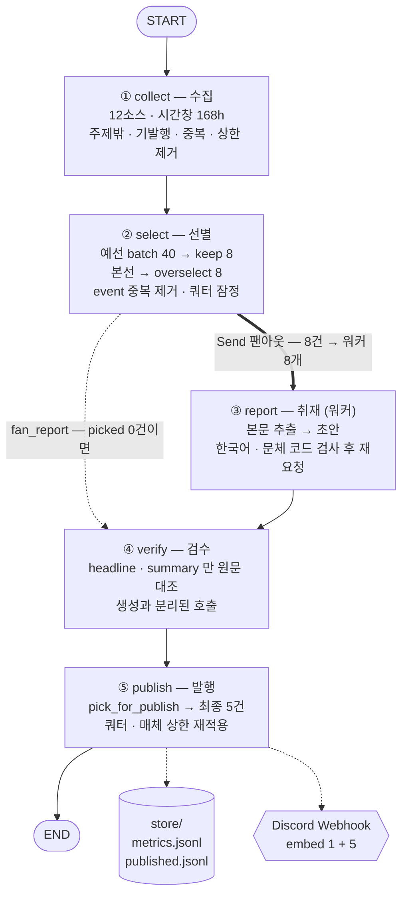

# 볼거리 브리핑 — 뉴스레터 에이전트 보고서

> 매일 아침 9시 50분, 문화·공간 소식 200여 건을 읽고 다섯 건을 골라 디스코드로 보내는 에이전트입니다.
> 코드는 `graph.py` 한 파일, 실행은 `run.py`, 편집 방향은 `audience.yaml` 에 있습니다.

| | |
|---|---|
| 분야 | 문화 콘텐츠(OTT·영화·책) + 공간(전시·건축·**공연**) |
| 소스 | **17곳 — 국내 8 · 해외 9** (RSS 16 + 공공 API 1) |
| 파이프라인 | 수집 → 선별 → 취재 → 검수 → 발행 (LangGraph 노드 5개) |
| 쿼터 | 문화 2 · 공간 3 (최소 보장, 실측 비율에 맞춤) |
| 발행처 | Discord Webhook (embed 6개 = 리드 1 + 기사 5) |
| 누적 실행 | 23회 (`store/metrics.jsonl`) |

### 루브릭 항목별 근거가 있는 곳

| 루브릭 | 근거 | 어디에 |
|---|---|---|
| ① 수집 경로 3개 이상 | **17곳** — RSS 16 + 공공 API 1 (국내 8 · 해외 9) | 2절 채택표 |
| ① 소스 선택·탈락 기준의 타당성 | 관문 G1 본문 · G2 생존 · G3 접근 + 네 번째 축(무엇을 싣는가). 후보 110여 곳 실측 | 2절 · `settings.yaml` 묘지 · `source_audit.py` |
| ① 선별 기준의 정의 | `audience.yaml` 의 중요도 기준 6개 · 버릴 것 8개 — 전부 예/아니오로 답할 수 있는 형태 | 1절 · 3절 |
| ① **기준이 동작했다는 근거(수치·라벨)** | 깔때기 수치 · 쿼터 `n/m` · **채택 사유(`＋`)** · **토픽 라벨** · **중복 판정 라벨 수** · 탈락 사유(`−`) | 3-5절 · 5-1절 로그 · `store/metrics.jsonl` |
| ② 단순 요약을 넘은 인사이트 | `why` 칸 — "이걸 알면 무엇이 달리 보이는지" | 5-2절 발행물 |
| ② 할루시네이션 검수 | `check()` — 생성과 **분리된 호출**, `headline`·`summary` 만 원문 대조 | 5-4절 |
| ② 검수 실패 시 대안 | 그 건만 버리고 계속 진행 · 문체는 최대 2회 재요청 · 0건인 날도 발행 | 5-4절 층 표 |
| ③ 엔드투엔드 무오류 구동 | 전 구간 콘솔 로그 + 누적 실행 기록 | 5-1절 · 5-3절 |

---

## 1. 분야 및 독자 정의

### 왜 AI 뉴스에서 문화·공간으로 옮겼나

처음 만든 것은 AI 뉴스 브리핑이었습니다(`f4c1c85 문화·공간 브리핑으로 전환` 이전 커밋에 그대로 남아 있습니다). 두 가지 이유로 옮겼습니다.

1. **과제가 지정한 6개 소스와 겹칩니다.** 과제는 특정 AI 매체를 대상에서 제외하도록 정해 두었는데, AI 뉴스 도메인에서 그 여섯 곳을 빼면 사다리의 1·2칸이 거의 비어 버립니다.
2. **AI 뉴스는 "오늘 뭘 해야 하는가" 를 바꾸지 않는 날이 더 많습니다.** 반면 문화·공간은 독자의 행동(볼 것을 고른다 / 갈 곳을 정한다)과 직접 이어집니다. 뉴스레터가 읽히는 이유를 더 잘 설명합니다.

### 독자 (`audience.yaml`)

```yaml
독자:
  누구: "볼 만한 것과 가볼 만한 곳을 찾는 사람 — 화제작보다 덜 알려진 것을 선호"
  이미_아는_것: "주요 OTT 구독 중. 박스오피스·베스트셀러 상위권과 이미 화제인 작품은 알고 있음"
```

**"이미 아는 것" 을 따로 적은 이유**가 이 프로젝트의 중심입니다. 뉴스레터의 가치는 "중요한 것" 이 아니라 "이 사람이 아직 모르는데 알면 좋을 것" 입니다. 넷플릭스 주간 1위는 중요하지만 독자는 이미 압니다. 그래서 버릴 것 목록에 `"이미 화제인 작품의 또 다른 리뷰 — 넷플릭스 주간 1위, 베스트셀러 1위"` 가 들어 있습니다.

### 묶음 — '무엇' 이 아니라 '어떻게 접하는가'

```yaml
묶음설명:
  문화: "집이나 손 안에서 보고 읽는 것. 스트리밍·극장·책"
  공간: "직접 찾아가서 몸으로 겪는 것. 전시장·미술관·공연장·건축물"
```

국내 소스를 늘리며 **공연**을 토픽에 더했습니다(`월간 객석`). 공연은 "직접 가서 몸으로 겪는 것" 이라 전시·건축과 같은 *공간* 묶음입니다 — 기존 목록에는 전시장과 건축물은 있었는데 공연장이 비어 있었습니다.

데스크지침은 **일부러 "반드시" 를 쓰지 않았습니다.**

```yaml
- 이름: "공연"
  묶음: "공간"
  데스크지침: "공연 날짜와 공연장을 원문에 있는 대로. 출연자·지휘자·프로그램
              구성은 원문에 적힌 것만 쓸 것. 없으면 쓰지 말 것"
```

공연 기사는 프로그램 구성·출연진이 보도자료에만 있고 기사에는 없는 경우가 많습니다. 실제로 한 축제 기사에서 모델이 *'야간 답사'* 와 *'능침 특별 개방'* 을 지어내 검수에서 탈락했습니다(5-1절 로그). 6절의 러닝타임 사례와 같은 실패라, 같은 실수를 반복하지 않도록 처음부터 안전한 형태로 적었습니다.

묶음 이름만 주면 모델이 **"전시도 문화 아니냐"** 로 읽습니다. 실제로 그렇게 됐습니다 — 전시 기사 다섯 건이 전부 `문화` 로 들어와 공간 쿼터가 0건이 된 실행이 있었습니다. 그래서 묶음을 *행동* 으로 정의해 적었고, 최종적으로는 **모델에게 묶음을 묻지 않고 토픽에서 계산하는 쪽으로 바꿨습니다**(3절 참고).

### 중요도 기준을 쓸 때 지킨 두 규칙

- **기사 하나를 보고 예/아니오로 답할 수 있는 질문으로.** "좋은 기사인가" 는 답할 수 없습니다. "지금 실제로 볼 수 있거나 갈 수 있는가" 는 답할 수 있습니다.
- **추상어 말고 구체적으로.** 버릴 것에 "홍보성" 이라고 쓰면 모델마다 다르게 해석합니다. `"캐스팅·촬영 시작·제작 확정 등 아직 결과물이 없는 소식"` 처럼 셀 수 있게 적었습니다.

실제 중요도 기준 4개(우선순위 순):

1. 지금 실제로 볼 수 있거나 갈 수 있는가 — 스트리밍 중이거나, 상영 중이거나, 전시 기간 안인가
2. 어디서 볼 수 있는지가 글에 적혀 있는가 — 플랫폼 이름, 극장, 전시장
3. 덜 알려진 것인가 — 화제작·상위권이 아니라 묻혀 있던 것인가
4. 왜 볼 만한지 구체적인 근거가 있는가 — 연출·문장·공간에 대한 실제 묘사

---

## 2. 소스 채택표

### 관문 세 개

소스는 취향이 아니라 **통과/탈락이 갈리는 관문**으로 골랐습니다. `source_audit.py` 가 LLM 없이 결정론적으로 잽니다(결과는 `store/source_audit.json`).

| 관문 | 무엇을 보나 | 기준 |
|---|---|---|
| **G1 본문** | 원문 주소에서 본문이 추출되는가 | 평균 `min_body = 500자` 이상 |
| **G2 생존** | 7일 창 안에 기사가 있는가 | `in_window > 0` |
| **G3 접근** | 주소가 응답하는가 | HTTP 200 · `entries > 0` |

`min_body` 는 600 → 500 → **450** 으로 두 번 낮췄습니다. 기준을 소스에 맞춰 무르게 한 것이 아니라, **"본문이 있긴 한데 짧게 주는 매체" 와 "본문을 아예 안 주는 매체" 를 가르는 선이 어디인가**를 실측이 알려준 결과입니다.

| 값 | 왜 내렸나 | 경계에 있던 것 |
|---|---|---|
| 600 | 최초값 | — |
| 500 | ArchDaily 평균 585자 — 600이면 아슬아슬 | ArchDaily 585 |
| **450** | **국내 매거진은 본문이 짧다.** 해외 기준을 그대로 쓰면 국내 소스가 먼저 떨어진다 | 월간미술 452 · 동아 문화 1,094(최소 268) |

떨어진 쪽은 **0자**(Dezeen·RogerEbert·NYT Books·조선 문화)라 450 언저리에 몰려 있지 않습니다. 즉 이 관문은 여전히 "본문을 주느냐 마느냐" 를 가르지, 근소한 차이로 소스를 가르고 있지 않습니다.

한 가지 정정할 것이 있습니다. 450으로 낮추면 452자로 탈락했던 **월간미술이 되살아날 것으로 예상했는데, 실제로는 살아나지 않았습니다.** 다시 재 보니 7일 창 안에 기사가 0건(G2)이라, 본문 관문을 넘어도 쓸 수 없는 소스였습니다. 묘지에 적힌 사유(`본문 452자 (G1)`)가 실은 **첫 번째로 걸린 관문일 뿐 진짜 병목이 아니었던** 것입니다. `settings.yaml` 의 해당 줄을 고쳐 두었습니다.

### 채택 — 17곳 (2026-09-15 13:08 실측, 창 168h, 본문 표본 3건)

| 소스 | 방식 | 전체 | 7일 내 | 본문 성공 | 평균 본문 | 최소 본문 | 발행 기여(23회) |
|---|---|---:|---:|---:|---:|---:|---:|
| 문화포털 전시 | API | 7 | 7 | 3/3 | 7,033자 | 2,142 | **26건** |
| Colossal | RSS | 10 | 10 | 3/3 | 2,327자 | 1,932 | 14건 |
| 경향 문화 | RSS | 50 | 50 | 2/3 | 1,055자 | 423 | 14건 |
| 오마이뉴스 문화 | RSS | 20 | 20 | 3/3 | 2,998자 | 2,636 | 10건 |
| Guardian Books | RSS | 28 | 15 | 3/3 | 6,223자 | 5,139 | 6건 |
| IndieWire | RSS | 12 | 12 | 3/3 | 5,537자 | 4,652 | 5건 |
| Designboom | RSS | 10 | 10 | 3/3 | 3,903자 | 2,669 | 5건 |
| 월간디자인 | RSS | 10 | 10 | 3/3 | 3,187자 | 1,641 | 4건 |
| Guardian Art | RSS | 23 | 17 | 2/3 | 4,619자 | 377 | 3건 |
| 동아 문화 | RSS | 50 | 50 | 2/3 | 1,094자 | 268 | 3건 |
| 서울신문 라이프 | RSS | 28 | 28 | 3/3 | 2,267자 | 1,765 | 3건 |
| LitHub | RSS | 10 | 10 | 3/3 | 3,438자 | 1,956 | 2건 |
| ArchDaily | RSS | 24 | 24 | 3/3 | 585자 | 518 | 2건 |
| WhatsOnNetflix | RSS | 50 | 50 | 3/3 | 6,467자 | 2,578 | 0건 |
| Decider | RSS | 10 | 10 | 3/3 | 3,597자 | 1,448 | 0건 |
| 월간 객석 | RSS | 8 | 4 | 3/3 | 4,430자 | 3,122 | 0건 |
| 독서신문 | RSS | 50 | 29 | 2/3 | 876자 | 286 | 0건 |

### 탈락 — 15곳 이상 (`settings.yaml` 하단에 사유와 함께 남겨 둠)

다시 넣지 않도록 **탈락 사유를 코드 옆에 적어 두었습니다.**

| 소스 | 실측 | 걸린 관문 |
|---|---|---|
| **Dezeen** | 7일 50건으로 **물량 1위**, 본문 추출 **0자** | G1 |
| RogerEbert | 본문 추출 0자 | G1 |
| NYT Books | 본문 추출 0자 | G1 |
| Criterion | 본문 0자 + 7일 내 1건 | G1·G2 |
| 월간미술 | 본문 452자(450 기준 통과)이나 **7일 내 0건** | G2 |
| 한겨레 문화면 | 30건 **전량 날짜 없음** → 창 판정 불가 | G2 |
| 조선 문화 | 100건 중 94건이 창 안인데 **본문 0자** | G1 |
| 세계 문화 · 한겨레21 · 시사IN | 항목은 있으나 날짜 전량 없음 | G2 |
| 기획회의 · 스트리트H · 헤이팝 | 7일 내 0건 | G2 |
| 브리크 매거진 | 7일 내 0건, 발행이 뜸함 | G2 |
| 씨네21 · 네오룩 · MMCA · 아트맵 · VMSPACE · KOPIS · 채널예스 · 아트인컬처 · 아트바바 · 디자인정글 · 더뮤지컬 · 플레이디비 · 아르코 · KMDb · 노컷 · 한국일보 · 중앙 · 엘르 · 에스콰이어 · 톱클래스 · 예술경영 · 뉴스페이퍼 · 아트렉처 | 404 또는 `entries` 0 | G3 |
| 인디포스트 · 서울문화재단 | 403 | G3 |
| 퍼블릭아트 · 북즐라이프 · 행복이가득한집 · 럭셔리 | 접속 불가 | G3 |
| culture.go.kr 구 openapi | HTML 에러페이지, 폐기됨(진짜 키로도 동일) | G3 |
| api.kcisa.kr `API_CCA_1xx` | data.go.kr 키를 받지 않음 (전부 403) | G3 |
| 한국문화정보원_전시회정보(odcloud) | 2024년 전시 36건짜리 **정지된 스냅샷** — 진행 중 0건·링크 없음·장소 없음 | G1·G2 |
| 과제 지정 제외 6개 AI 매체 | — | 검토 대상에서 제외 (과제 지정) |

### 관문은 넘었는데 뺀 것들 — 네 번째 축

국내 비중을 늘리려고 후보 **110여 곳**을 재면서, G1~G3 와는 **다른 축**에서 떨어지는 소스들이 나왔습니다. 접근되고, 기사가 있고, 본문도 길게 주는데 — **싣는 내용이 이 뉴스레터의 것이 아닌** 경우입니다.

| 소스 | 관문 | 그런데 무엇을 싣나 | 어느 기준에 걸리나 |
|---|---|---|---|
| CJ뉴스룸 | 본문 1,504자 통과 | 협력사 대금 조기 지급 · CGV 9월 라인업 | **당사자 발표(tier1)** = 홍보물. `tier1_max: 0` |
| 연합 문화 | 120건, 물량 최다 | 공모 선정 · 협의회 출범 · 에미상 수상 불발 | 버릴 것 — 수상·발표·홍보 |
| 맥스무비 | 선필터 60% 통과 | 부고 · 박스오피스 50만 돌파 · 예능 민박 | 버릴 것 — 흥행 성적·연예 |
| 익스트림무비 | 15건 전부 창 안 | **캐스팅 확정 · 촬영 시작** | 버릴 것 — 결과물이 없는 소식 |
| 디에디트 | 본문 4,256자 | 아이폰 듀오 · 9월 신상 리스트 | 도메인 밖 — 가전·쇼핑 |
| 보그 · GQ · 마리끌레르 | 본문 1,200~1,700자 | 패션 · 뷰티 · 브랜드 협찬 이벤트 | 버릴 것 — 협업 상품 |
| 국민 문화 | 본문 2,183자 | 관광 할인 · 기관 인사 | 도메인 밖 |

**관문 세 개는 "쓸 수 있는가" 만 잽니다.** "쓸 만한가" 는 `audience.yaml` 의 버릴 것 목록이 잽니다. 두 가지를 섞어 한 관문으로 만들지 않은 것이 이 설계의 이점입니다 — 관문은 코드로 결정론적으로 돌고(`source_audit.py`), 내용 판단은 선별 단계의 언어 모델이 합니다. **CJ뉴스룸을 뺀 근거가 "본문이 짧아서" 가 아니라 "당사자 발표라서" 라고 말할 수 있는 것**이 그 덕분입니다.

### 국내 OTT 플랫폼 — 사다리 1·2칸이 통째로 비어 있다

"넷플릭스·디즈니플러스·티빙·웨이브에서 직접 가져올 것은 없는가" 를 실제로 확인했습니다.

| 대상 | 결과 |
|---|---|
| 넷플릭스 뉴스룸 (ko · en) | 404 |
| 티빙 | 404 |
| 웨이브 | `entries` 0 |
| 키노라이츠 · 왓챠 블로그 | 접속 불가 |

**국내 OTT 는 RSS 를 내지 않습니다.** 게다가 설령 있었더라도 이 설계에서는 쓰지 않았을 것입니다 — 플랫폼 공식 발표는 **당사자 발표(tier1)** 이고, 이 분야에서 tier1 은 곧 홍보물이라 `tier1_max: 0` 으로 막아 두었기 때문입니다.

그리고 이 범주에 대한 실증이 이미 있습니다. 넷플릭스 신작 정보는 **`WhatsOnNetflix`(2칸 매체)로 이미 들어오고 있고, 그 소스의 발행 기여는 14회 동안 0건**입니다. 신작 공지는 "이미 화제인 것" 이거나 "아직 볼 수 없는 것" 이라 중요도 기준 1·3번에서 떨어집니다. **가져올 경로가 없었을 뿐 아니라, 있었어도 발행되지 않았을 것**이라는 뜻입니다.

### 이 표에서 읽어야 할 것

**① 물량이 아니라 사용 가능성으로 고릅니다.**
Dezeen 은 7일 50건으로 후보 중 물량 1위였습니다. 그런데 본문 추출이 0자라 **취재 단계에서 100% 탈락**합니다. 수집 숫자만 늘리고 발행에는 한 건도 기여하지 못하는 소스입니다. 탈락시켰습니다.

**② 관문 통과와 기여도는 다른 것을 잽니다.**
WhatsOnNetflix 는 7일 50건 · 본문 평균 6,467자로 지표가 가장 좋은 축인데 **23회 동안 발행 0건**입니다. 넷플릭스 신작 공지는 "이미 화제인 것" 과 "아직 볼 수 없는 것" 이라 중요도 기준 1·3번에서 떨어집니다. 관문은 *쓸 수 있는가*, 기여도는 *쓸 만한가* 를 잽니다. `report_card.py` 가 후자를 매 실행 쌓아 두고, 몇 주째 0이면 목록에서 빼라고 표시합니다.

**③ 사다리를 한 칸 올라간 소스가 1등입니다.**
국내 전시는 **RSS 가 없습니다**. 매체 RSS(2칸)로는 못 구해서 공공 API(1칸, 문화포털 `cultureinfo`)까지 올라갔고, 그 소스가 오래 발행 기여 1위였습니다. 대신 대가가 있습니다 — GitHub Actions 러너에서는 이 주소에 닿지 않습니다(로컬 0.9초 성공 / 러너 ConnectTimeout 30초 × 3회).

**"해외라서" 는 아니었습니다.** 처음에는 그렇게 적어 두었는데, 확인해 보니 틀렸습니다.

| 확인한 것 | 결과 |
|---|---|
| `AAAA` 레코드(IPv6) | 없음 → IPv6 경로 문제가 아니다 |
| `A` 레코드 | `27.101.236.63` 하나뿐 |
| 국내가 아닌 다른 네트워크에서 호출 | **HTTP 401 응답** → 연결 자체는 된다 |

즉 전면 해외 차단이 아니라 **러너가 쓰는 대역(Azure)이 막히는 것**입니다. `data.go.kr` 은 서비스별 IP 등록·차단(`UNREGISTERED_IP_ERROR 32` · `BLACKLIST_IP_ACCESS_ERROR 29`)을 두는데, 러너 IP 는 매번 바뀌어 등록으로는 풀 수 없습니다.

**그래서 캐시로 풉니다.** 국내에서 돌릴 때 받은 결과를 `store/source_cache.json` 에 남기고, CI 는 API 대신 그것을 읽습니다. 전시는 몇 주씩 열리므로 하루 이틀 지난 목록도 쓸 만합니다 — **도메인 특성이 해법을 싸게 만들어 준 경우**입니다.

캐시 설계에서 한 가지를 의도적으로 하지 않았습니다. **항목의 시각을 새로 찍지 않습니다.** 받은 때를 그대로 두므로, 캐시가 시간 창(168h)보다 오래되면 수집 단계에서 저절로 전부 탈락합니다. 유효기간 설정도, 만료 검사 코드도 필요 없습니다 — *이미 있는 관문이 캐시에도 그대로 걸리게 두면 됩니다.* 캐시를 썼다는 사실과 나이는 `· 캐시 사용: 문화포털 전시 0.4일 전 7건` 으로 로그에 남습니다. 신선한 척하지 않습니다.

**④ 국내 종합지 넷은 선필터 없이는 못 씁니다.**
국내 종합 문화면은 절반이 연예·가요·부고입니다. LLM 을 부르기 전에 **비용 0의 결정론적 문자열 검사**로 좁힙니다(`filters.pick` 27개 키워드). 실측 로그 한 줄:

```
· 선필터: 경향 문화 -18, 동아 문화 -31, 서울신문 라이프 -17, 오마이뉴스 문화 -13
```

**매 실행 79건이 예선에 들어가기도 전에 빠집니다.** 이 79건이 그대로 들어왔다면 예선 묶음이 두 개 더 늘고, 그만큼 LLM 호출과 토큰을 쓰고도 버려졌을 것입니다. 국내 비중을 늘리면서 선필터가 선택이 아니라 **전제 조건**이 됐습니다.

**⑤ 국내 쪽에 무게를 실었습니다.**
독자가 실제로 갈 수 있는 곳은 국내입니다. 그런데 초기 목록은 해외 9 · 국내 3 이었습니다 — 영어권 매체가 RSS 를 잘 내기 때문이지, 독자에게 더 쓸모 있어서가 아니었습니다. 후보 **110여 곳**을 재서 국내 5곳을 더했습니다(**국내 8 · 해외 9**).

| 추가 | 성격 | 창 안 | 본문 | 선필터 |
|---|---|---:|---:|---|
| 월간 객석 | 공연예술 전문 매거진 | 8 | 4,430자 | 불필요 |
| 독서신문 | 책 전문지 | 50 → 29 | 876자 | **일부러 안 검** |
| 동아 문화 | 종합지 문화면 | 50 → 19 | 1,094자 | 필요 |
| 서울신문 라이프 | 종합지(문화 전용 RSS 없음) | 26 → 9 | 2,267자 | 필요 |
| 오마이뉴스 문화 | 시민기자 — "덜 알려진 것" 성향 | 20 → 7 | 2,998자 | 필요 |

**월간 객석은 공연을 데려옵니다.** 공연은 "직접 가서 몸으로 겪는 것" 이라 묶음상 *공간* 에 속합니다 — 기존 목록에 전시·건축은 있었지만 공연이 비어 있었습니다.

**독서신문에는 선필터를 일부러 걸지 않았습니다.** 걸어 보니 29건 중 11건이 떨어지는데, 그중에 `[신간] 『전쟁은 어떻게 정의를 훔쳤을까?』` 같은 **정상 신간 소개 3건**이 섞여 있었습니다. 제목에 '책·도서' 라는 낱말이 없었기 때문입니다. 종합지에는 필수인 장치가 **전문지에는 역효과**입니다 — 선필터는 "주제 밖을 쳐내는 것" 이지 "주제를 확인하는 것" 이 아니기 때문입니다. 물량은 `per_source_max: 6` 이 이미 막고 있습니다.

**⑥ 문화가 공간에 밀립니다 — 소스를 늘려도 그대로입니다.**
`report_card.py` 의 누적 기여를 묶음별로 갈라 보면 비대칭이 뚜렷합니다.

| 묶음 | 전용 소스 | 누적 발행 | 소스당 |
|---|---:|---:|---:|
| 공간 (전시·건축·공연) | 7곳 | **40건** | 5.7 |
| 문화 (OTT·영화·책) | 6곳 | **13건** | 2.2 |

소스 수는 비슷한데 기여가 **3배** 차이 납니다. 원인은 중요도 기준에 있습니다 — 1번 *"지금 실제로 볼 수 있거나 갈 수 있는가"* 와 2번 *"어디서 볼 수 있는지가 글에 적혀 있는가"* 는 **전시 기사가 구조적으로 잘 만족합니다.** 전시 기사에는 기간과 장소가 거의 항상 적혀 있으니까요. 반면 영화·OTT 기사는 신작 공지(아직 볼 수 없음)나 리뷰(어디서 볼지 안 적힘)가 많습니다.

`WhatsOnNetflix` 와 `Decider` 가 **둘 다 17회 누적 0건**인 것이 같은 이야기입니다. 이건 소스가 나쁘다기보다 **기준이 의도대로 작동하는 증거**입니다 — "지금 갈 수 있는 전시" 가 "다음 달 공개될 시리즈" 를 이기는 것은 이 독자에게 맞는 결과입니다.

**⑧ 목록형 소스의 후보 상한을 따로 낮췄습니다 (6 → 3).**

`문화포털 전시` 는 여유분 적용 후 13회에서 **발행분의 27% 를 차지해 1위**였습니다. 발행분 매체 상한(2건)이 이미 걸려 있는데도 그렇습니다 — 후보 단계에서 6건까지 들어와 본선 자리를 많이 가져가기 때문입니다.

문제는 양이 아니라 **재료의 성격**입니다. 이 소스는 행사 DB 라 원재료가 *목록 레코드* 입니다. 기간·장소는 정확하지만 비평이 없어, 요약이 안내문으로 나옵니다. 교양 쪽으로 기준을 옮겨도 **없는 맥락을 프롬프트로 만들 수는 없습니다.**

그래서 `Source` 에 `max_items` 를 두어 이 소스만 후보 상한을 3으로 낮췄습니다. 빼지는 않았습니다 — 국내 전시를 가진 유일한 소스이고, 그중 기획전은 맥락이 있기 때문입니다. 실제로 상한을 낮춘 뒤 올라온 두 건은 `《강주현: 연결의 비정형》`(유휴공간을 다시 보는 기획)과 `ACC 《아시아의 장치들》`('받아쓰기-재현하기-다시쓰기')로, **목록 중 맥락이 있는 쪽이 남았습니다.**

*상한은 나쁜 소스를 벌하는 장치가 아니라, 다른 소스가 겨룰 자리를 만드는 장치입니다.*

**⑦ 그래서 쿼터를 실측에 맞췄습니다 (문화 3·공간 2 → 문화 2·공간 3).**

쿼터는 **최소 보장**이지 상한이 아닙니다. 그러니 이 값은 *바라는 비율* 이 아니라 **이만큼은 실제로 채울 수 있는 양**으로 잡아야 합니다. 여유분 적용 후 10회 실측:

| | 문화 | 공간 |
|---|---:|---:|
| 회차 평균 발행 | 1.7건 | 2.9건 |
| 누적 발행 | 17건 (37%) | 29건 (63%) |
| 쿼터 충족 | **2/10회** | 9/10회 |

문화 3 은 **10회 중 8회가 미달**이었습니다. 소스를 12곳에서 17곳으로 늘려도 비율은 그대로였습니다 — 앞에서 본 대로 소스를 더해서 풀리는 문제가 아니기 때문입니다.

**늘 미달로 남는 목표는 신호를 주지 못합니다.** 매 회차 `문화 1/3` 이 찍히면, 그게 이상한 날인지 보통 날인지 구분되지 않습니다. 실측 비율(2:3)에 맞추면 미달이 다시 *예외* 가 되고, 그때 비로소 로그가 경고가 됩니다.

바꾸고 나서 곧바로 `문화 2/2 · 공간 2/3` 인 회차가 나왔습니다 — 이번엔 **공간 쪽이 모자란 날**이었고, 그 사실이 로그에 드러납니다. 문화 3 이었다면 `문화 2/3 · 공간 2/2` 로 찍혀 엉뚱한 쪽을 가리켰을 것입니다.

값을 치르는 부분도 적어 둡니다. 문화 후보가 넉넉한 날에는 보장 자리가 하나 줄어 **문화가 한 건 덜 들어갈 수 있습니다.** 다만 그런 날은 10회 중 2회였고, 그때도 남은 자리는 순위대로 채워지므로 문화가 좋으면 어차피 들어옵니다.

---

## 3. 선별 로직 설계

### 3-1. 왜 독립 채점이 아니라 상대평가인가

**개수가 고정된 문제는 채점 문제가 아니라 정렬 문제입니다.**

기사마다 0~10점을 매기는 방식을 먼저 생각했지만, 5건을 골라야 하는 상황에서는 쓸 수 없습니다. 독립 채점은 동점이 몰립니다 — 7점이 열두 건 나오면 **다섯 번째에서 자를 근거**를 주지 못합니다. "중요한 순서대로 최대 k건" 으로 물으면 모델이 한 화면에 놓고 견주므로 순위 자체가 답이 됩니다.

### 3-2. 왜 한 번에 다 안 넣고 예선 → 본선인가

후보는 매 실행 **99건 안팎**입니다(국내 소스를 더하기 전에는 71건이었습니다). 한 번에 다 넣으면 두 가지가 나빠집니다.

- **판단이 흔들립니다** — 목록이 길수록 앞뒤 항목에 따라 같은 기사의 평가가 달라집니다
- **토큰만 씁니다** — 70건의 제목을 전부 주고 5건을 받는 것은 낭비입니다

그래서 `batch: 40` 씩 잘라 예선을 돌리고(`prelim_keep: 8`), 통과분 16건을 모아 본선을 돌립니다. 40은 "한 화면에서 견줄 수 있는 크기" 로 잡은 값입니다. 예선 묶음끼리는 서로를 모르므로 **묶음 운**이 생기는데, 통과 수를 목표(5)보다 넉넉한 8로 둬서 줄였습니다.

실측 통과율: **99건 → 예선 20건 → 본선 8건 → 발행 5건 (약 8%)**

소스를 17곳으로 늘리자 예선 묶음이 2개에서 **3개**로 늘었습니다(`40 + 40 + 19`). 예선 LLM 호출이 한 번 더 늘어난 값을 치르고, 그 대신 국내 기사가 후보에 들어옵니다.

### 3-3. 왜 5건이 아니라 8건을 뽑는가 — 이번에 고친 것

**문제(실측)**: 쿼터는 `select()` 에 걸려 있는데, 그 뒤 `verify()` 가 건수를 **줄입니다**. 앞에서 문화 3 · 공간 2(당시 쿼터)를 맞춰 놓아도, 검수가 그중 몇 건을 떨어뜨리면 발행 시점에는 배분이 이미 깨져 있습니다.

`store/metrics.jsonl` 의 적용 전 7회 전부입니다 (당시 쿼터 문화 3 · 공간 2, 목표 5건):

| 회차 | 발행 | 묶음 | 매체 | 무엇이 깨졌나 |
|---|---:|---|---|---|
| 16:11:56 | 5 | 건축·디자인 2 · OTT 1 · 예술 2 | Colossal 2 | 묶음 라벨 자체가 흔들림 |
| 16:12:49 | 3 | 공간 2 · 문화 1 | — | 목표 미달 |
| **16:30:30** | **2** | 공간 2 · **문화 0** | **Designboom 2** | **한 묶음이 통째로 빔** |
| **16:41:01** | **2** | 문화 2 · **공간 0** | **문화포털 전시 2** | **반대쪽이 통째로 빔** |
| 16:42:29 | 4 | 공간 1 · 문화 3 | **IndieWire 3** | 한 매체가 절반 넘게 차지 |
| **16:43:53** | **3** | 문화 3 · **공간 0** | 문화포털 전시 2 | **또 한 묶음이 빔** |
| 10:24:06 | 3 | 공간 2 · 문화 1 | — | 목표 미달 |

**7회 중 목표 5건에 닿은 것은 1회뿐이고, 한 묶음이 통째로 빈 것이 3회입니다.** 16:30 과 16:41 은 연속한 두 회차인데 비는 쪽이 서로 반대입니다 — 어느 한쪽으로 기우는 편향이 아니라, **보장이 걸린 자리가 틀렸다**는 신호입니다.

**보장은 결과가 정해지는 자리에서 걸어야 합니다.** 앞에서만 걸면 뒤에서 무너집니다.

고친 방식:

- `overselect: 8` — 선별은 목표(5)가 아니라 **여유분 8건**을 뽑습니다. 실측 검수 탈락률 30~40% 를 메우는 크기입니다
- `max_per_source: 2` — **발행분 기준** 매체 상한입니다. 후보 상한(`per_source_max: 6`)과는 거는 자리가 다릅니다
- `pick_for_publish(verified)` — 발행 직전에 **2단계**로 확정합니다. 1차에 묶음 쿼터를 채우고, 2차에 남은 자리를 순서대로 메웁니다. 쿼터는 **최소 보장(하한)** 이지 상한이 아닙니다 — 한쪽이 모자란 날에는 다른 쪽이 그 자리를 가져갑니다
- 탈락분은 사유와 함께 `⑤ 발행` 로그에 남습니다

**치르는 값**: 취재·검수가 5건 → 8건이라 **LLM 호출이 약 1.6배**입니다. 실측 실행 시간 38~59초. 배분이 깨진 브리핑을 보내는 것보다 싸다고 판단했습니다.

지표에 `quota_dropped` (= 검수 합격 − 실제 발행) 를 새로 기록해, 여유분 8이 적절한지 되짚을 수 있게 했습니다.

### 3-4. 부탁을 코드로 바꾼 자리들

**프롬프트에 적은 것은 요청이지 보장이 아닙니다.** 출력만 보고 확인할 수 있는 규칙은 전부 코드로 옮겼습니다.

| 지시 | 프롬프트만 두면 | 코드로 어떻게 |
|---|---|---|
| "같은 사건은 하나만" | 같은 전시를 다룬 두 기사가 둘 다 들어온다 | `select()` 가 `event` 라벨을 세고 중복을 떨어뜨린다 |
| "묶음은 문화/공간 중 하나" | 전시 기사 5건이 전부 '문화' 로 들어왔다 | 모델에게 **묻지 않는다**. 구체적인 `topic` 만 묻고, 묶음은 `audience.yaml` 에서 계산한다 (`group_of`) |
| "한국어 '~합니다'체로" | 영어로 오거나 평서체로 온다 | `report()` 가 한글 포함 여부와 문장 끝을 검사하고 최대 2회 재요청, 못 고치면 로그에 남긴다 |
| "토픽은 이 여섯 중 하나" | '전시·공간' 대신 '전시' 가 와서 색이 기본값으로 떨어졌다 | 구조화 출력 스키마에 `enum` 으로 못박는다 |
| 모델이 범위 밖 번호를 준다 | 조용히 IndexError | `ask_picks()` 가 `0 <= index < len` 으로 거른다 |

**`event` 라벨을 좁게 정의한 이유**도 실측입니다. 처음에는 라벨 설명이 넓어서, 서로 다른 건축물 두 건이 `건축 디스플레이` 하나로 묶여 한 건이 잘렸습니다. 지금은 *"작품·전시·책 하나를 식별하는 고유한 이름. 장르나 분야가 아니다"* 로 못박았습니다.

**`topic` 에 default 를 주지 않은 이유**: 기본값을 주면 구조화 출력에서 '선택 필드' 가 되어 모델이 통째로 생략합니다. 필수로 두고 `enum` 으로 값을 고정했습니다.

### 3-5. 기준이 실제로 동작했다는 근거 — 로그 실물

로그에 **탈락 사유**가 남지 않으면 선별이 잘못됐을 때 무엇을 고칠지 알 수 없습니다. `store/metrics.jsonl` 에서 그대로 인용합니다.

아래 두 블록은 **`run_id: 2026-09-15T12:03:45`** — 국내 소스를 더하기 전(소스 12곳·후보 71건)의 회차입니다. 이 회차를 고른 이유는 **매체 상한이 실제로 무언가를 떨어뜨린 유일한 기록**이기 때문입니다. 현재 설정(소스 17곳)의 로그는 5-1절에 전체를 실었습니다.

```
② 선별   71 → 8건 (여유분 8 · 최종 5건은 발행 직전 확정)
   쿼터(잠정): 문화 2/3 · 공간 6/2
   예선 묶음 40건 → 8건
   예선 묶음 31건 → 8건
   예선 통과 16건 (tier1 자동통과 0건 포함)
```

**채택된 것에도 사유가 남습니다.** 탈락만 남기면 "왜 이게 됐나" 에 답할 수 없습니다.

```
   ＋ ACC 필름앤비디오 《아시아의 장치들》 [전시·공간] — 아시아의 다양한 문화와
      기술적 접근 방식을 조명하며, 과거와 현재를 연결하는 다각적인 시각을 제공한다
   ＋ 권순익 ‘산에 비친 산…’ 展 [전시·공간] — 자연과의 조화를 통해 보는 새로운
      시각을 제시하여 관람객들에게 깊은 사유를 유도한다
   라벨: 서로 다른 사건 8개 / 채택 8건
```

대괄호 안이 **토픽 라벨**(쿼터가 쓰는 값)이고, 마지막 줄이 **중복 판정 라벨**이 실제로 서로 달랐는지입니다. 같은 사건이 여러 건 들어오면 이 수가 채택 건수보다 작아집니다 — `event` 라벨이 일하고 있다는 증거가 매 회차 숫자로 남습니다.

기준별로 무엇이 떨어졌는지:

```
− ‘Monday Night Football’ Schedule: Time,  — 자리 없음(묶음 문화)
− (Decider) Stream It or Skip It: ‘Drawn Together’ on Prime Video, A Steamy Take
  on ‘The Bodyguard’ From the Creator of the Sexy ‘Culpa Mia’ Movies
− (Designboom) JR sends giant wave across vatican apostolic library facade
− (Guardian Books) Farewell to Eden by Sebastian Faulks review – conflict and
  compromise, from a veteran of the genre
```

- 첫 줄은 **버릴 것**(스포츠 편성)이 걸린 경우
- 나머지는 본선에서 순위가 밀려 자리를 못 잡은 경우로, 사유에 **어느 묶음에서 밀렸는지**까지 남습니다

발행 단계의 후처리도 무엇을 했는지 남깁니다:

```
⑤ 발행   합격 6 → 발행 5건 → dry-run
   쿼터: 문화 1/3 · 공간 4/2
   매체: 문화포털 전시 2 · Guardian Books 1 · Colossal 2
   − 사라 앤티스의 부드러운 파스텔, 신화, 꿈, 그리고 르네상스를 불 — 자리 없음(5건 초과)
```

합격 6건 중 5건으로 줄었고(`quota_dropped: 1`), **매체별 2건 상한이 지켜졌습니다**(문화포털 2 · Colossal 2). 문화가 1건뿐인 날이라 남은 자리를 공간이 가져갔습니다 — 쿼터가 하한이라는 설계대로입니다.

국내 소스를 더한 뒤에는 후보가 다양해져 한 매체가 몰리는 일 자체가 줄었습니다. 5-1절의 최신 회차는 **매체 5곳에 1건씩**이라 상한이 걸릴 일이 없었고 `quota_dropped` 도 0입니다. 상한은 걸릴 때를 대비한 장치이지, 매번 걸려야 하는 장치가 아닙니다.

---

## 4. 파이프라인 구조도



### State (`Brief`) — 단계 사이를 실제로 건너가는 것만 담는다

| 키 | 리듀서 | 왜 |
|---|---|---|
| `hours` | 덮어쓰기 | 실행 인자 |
| `collected` | 덮어쓰기 | 수집 결과 |
| `picked` | 덮어쓰기 | 선별 결과 |
| `drafted` | **`operator.add`** | 취재 워커 8개가 **나눠서 채운다** — 합쳐야 한다 |
| `verified` | 덮어쓰기 | 검수는 **줄이는** 일이다 |
| `published_items` | 덮어쓰기 | 발행 노드만 쓴다 |
| `log` | **`operator.add`** | 모든 노드가 이어 붙인다 |

**`verified` 를 `drafted` 와 다른 키로 나눈 것이 핵심입니다.** 합치는 키(`drafted`)에 통과분을 돌려주면 줄지 않고 **늘어납니다**. 8건 취재 → 6건 합격을 `drafted` 에 쓰면 14건이 됩니다. *줄이는 단계는 합치는 키에 쓸 수 없습니다.*

같은 이유로 `published_items` 도 별도 키입니다. 집계를 `verified`(합격분)가 아니라 `published_items`(실제 나간 것)로 세는데, **이 둘이 다르다는 사실 자체가 후처리를 넣은 이유**입니다.

### 팬아웃 경계를 어디에 둘 것인가

기준은 **"이 단계는 다른 항목을 봐야 답할 수 있는가"** 입니다.

- **선별** — 5건을 고르려면 나머지를 다 봐야 합니다. 모읍니다
- **취재** — 기사 하나를 요약하는 데 다른 기사가 필요 없습니다. `Send()` 로 펼칩니다

워커(`WorkerState`)는 자기가 맡은 기사 하나만 받습니다. 전체 상황을 모릅니다.

`select → report` 는 조건부 엣지입니다(`fan_report`). 후보가 0건이면 워커를 만들지 않고 `verify` 로 바로 갑니다 — 0건인 날에도 파이프라인은 끝까지 돌아야 합니다.

### 되돌아가는 경로가 없다

`collect → select → report → verify → publish` 는 한 방향입니다. 검수에서 떨어졌다고 취재로 돌아가지 않습니다.

- **왜** — 못 채우는 날은 적은 대로 발행하기로 정했기 때문입니다
- **덕분에** — 재시도 횟수·비용 상한·무한 루프 방지 설계가 통째로 필요 없습니다
- **대신** — 0건인 날에도 "오늘은 조용합니다" 를 보냅니다. 아무것도 안 보내면 **파이프라인이 죽은 것과 구분이 안 됩니다**

---

## 5. 실행 기록

### 5-1. 엔드투엔드 콘솔 로그 (전체, `--dry-run`)

`run_id: 2026-09-15T14:50:21` · 소요 44.5초 · 소스 17곳 · 쿼터 문화 2 · 공간 3

```
   · 키: OPENAI_API_KEY=164자/sk-형 · DISCORD_WEBHOOK_URL=121자/URL형 · KCISA_SERVICE_KEY=64자/일반형
① 수집   전체 400 → 창(168h) 352 → 주제밖 -75 → 기발행 -6 → 중복 -0 → 상한 -174 → 후보 97건
   · 선필터: 경향 문화 -17, 동아 문화 -30, 서울신문 라이프 -16, 오마이뉴스 문화 -12
② 선별   97 → 8건 (여유분 8 · 최종 5건은 발행 직전 확정)
   쿼터(잠정): 문화 0/2 · 공간 8/3
   예선 묶음 40건 → 8건
   예선 묶음 40건 → 8건
   예선 묶음 17건 → 5건
   예선 통과 21건 (tier1 자동통과 0건 포함)
   ＋ 2025 공공수장고 야외 전시 프로젝트 《강주현: 연결의 비정 [전시·공간] — 전시가 공공수장고를 활용하여 현대미술의 새로운 시각과 연결성을 보여주며, 다양한 작품과 아이디어들이 
   ＋ ACC 필름앤비디오 《아시아의 장치들》 [전시·공간] — 아시아의 다양한 문화와 기술적 접근 방식을 조명하며, 과거와 현재를 연결하는 다각적인 시각을 제공한다
   ＋ 해체된 라디오가 전하는 소리... 사이먼 웨덤 × 홍라무 협업 [전시·공간] — 소리와 해체된 형태의 미술이 결합된 이번 퍼포먼스는 새로운 감각적 경험을 제공하며, 현대미술의 경계를
   ＋ 권순익 ‘산에 비친 산…’ 展 [전시·공간] — 자연과의 조화를 통해 보는 새로운 시각을 제시하여 관람객들에게 깊은 사유를 유도한다.
   ＋ Art History and Pop Culture Conver [전시·공간] — 대중문화와 미술 역사 사이의 경계를 허물며, 흥미롭고 다층적인 이야기로 관람객을 매료한다.
   ＋ Houston Center for Contemporary Cr [전시·공간] — 25년이라는 시간을 의미 있게 되새기며, 현대 미술의 흐름을 되짚는 기회를 제공한다.
   ＋ ‘He would have been the center of  [전시·공간] — 역사적 인물인 Emmett Till을 주제로 한 전시는 사회적 맥락을 반영하고, 관람객들에게 깊은 고
   ＋ Symmetry and Biomorphic Forms Char [전시·공간] — 유기적 형태와 비대칭적인 구성이 돋보이는 이 회화는 미술에 대한 새로운 관점을 제시한다.
   라벨: 서로 다른 사건 8개 / 채택 8건
   − Sara Anstis’ Soft Pastels Summon Mytholo — 자리 없음(묶음 공간)
   − 2. ‘성난 사람들 2’ 미국 에미상 3관왕···시상식 간 윤여정은 ‘여우조연상 불발’
   − 4. 남산케이블카서 중증장애인 자립 돕는 그림공모전 시상식 열려
   − 5. Why Was John Mulaney Censored At the Emmys?
   − 6. 로에베와 박종진 작가가 쌓아 올린 ‘시간의 층위’
   − 9. 매물로 나온 문학동네, 출판계 지각변동 오나
   − 10. 뮤지컬로, 달밤 답사로 느끼는 세계유산 조선왕릉
   − 12. Could this James Baldwin typewriter be an okay use of AI?
   − 14. WORLD HOT | UNITED KINGDOM CONTEMPORARY BALLET
   − 15. La Colmena - Multi-family Housing as Shared Neighborhood Infrastructure / Ancestra + Natura Futura
   − 18. 전 세계 커뮤니티센터 네 곳이 ‘포용’을 디자인하는 방식
   · 2025 공공수장고 야외 전시 프로젝트 《강주현: 연결의 비정형》 — 재요청 2회, 해결
   · 해체된 라디오가 전하는 소리... 사이먼 웨덤 × 홍라무 협업 퍼 — 재요청 2회, 미해결(문체 불일치)
   · 권순익 ‘산에 비친 산…’ 展 — 재요청 1회, 해결
   · 프레드리히 쿤나트의 ‘더 니어리스트 파라웨이 플레이스’에서 예술사 — 재요청 1회, 해결
   · ‘He would have been the center of ev — 재요청 1회, 해결
   · 로베르타 젠트리의 감각적인 그림은 대칭성과 생물형적 형태로 특징지 — 재요청 1회, 해결
③ 취재   8건
④ 검수   합격 6 · 불합격 2
   − ‘He would have been the center of everyt — 요약에서 에메트 틸이 살아있었다면 어떤 삶을 살았을지 상상한 부분이 '사진 도서관'이라고 표현되었으나, 원문에서는 'imagined photo library'로 단순히 '사진 도서관'이 아닌 '상상된 사진 도서관'이
   − 로베르타 젠트리의 감각적인 그림은 대칭성과 생물형적 형태로 특징지어진다 — 요약의 "생동감 있는 색감"은 원문에 언급된 "brilliant oranges and moody shades of blue"와 일치하지만, "균형 잡힌 구성"의 표현은 원문에서 "balanced composition
⑤ 발행   합격 6 → 발행 5건 → dry-run
   쿼터: 문화 0/2 · 공간 5/3
   매체: 문화포털 전시 2 · 오마이뉴스 문화 1 · 동아 문화 1 · Colossal 1
   − 휴스턴 현대 공예 센터, 25주년 기념 은 전시 개최 — 자리 없음(5건 초과)
```

이 로그 한 장에서 읽히는 것:

| 줄 | 무엇을 증명하나 |
|---|---|
| `· 키:` | 비밀값을 **값 대신 모양**으로 남긴다 — 세 키 모두 정상 (아래 5-4) |
| `① 수집` | 깔때기가 단계별로 몇 건을 걸렀는지. **상한(-171)이 중복(-0)보다 훨씬 많이 거른다** — 7일 창이라 한 소스가 쉽게 독차지한다 |
| `· 선필터:` | 국내 종합지 4곳에서 **80건**이 LLM 을 부르기 전에 빠진다 — 비용 0의 결정론적 검사 |
| `예선 묶음 40 / 40 / 19` | 소스를 17곳으로 늘려 묶음이 3개가 됐다. 늘어난 호출이 국내 기사를 데려오는 값이다 |
| `② 선별 … 쿼터(잠정): 문화 3/2` | 선별 시점엔 문화가 쿼터를 넘겼다. "잠정" 인 이유는 취재가 토픽을 다시 쓰기 때문이다 |
| `− … 자리 없음(묶음 …)` | 탈락 사유에 **어느 묶음에서 밀렸는지**가 남는다 |
| `− … 본문 부족` | G1 관문이 **실행 중에도** 동작한다. 모자란다고 다시 긁어 오지 않는다 |
| `④ 검수   합격 5 · 불합격 2` | **할루시네이션을 2건 잡았다** |
| `⑤ 발행   합격 5 → 발행 4건` | 후처리가 한 건을 떨어뜨렸다(`quota_dropped: 1`) |
| `− … 매체 상한(서울신문 라이프 2건)` | **매체 상한이 실제로 일했다.** 한 매체가 3건을 차지하려던 것을 막았다 |
| `쿼터: 문화 2/2 · 공간 2/3` | 문화는 채웠고 **이번엔 공간이 모자랐다.** 쿼터를 실측에 맞춘 덕에 로그가 모자란 쪽을 정확히 가리킨다 |

### 5-2. 실제 발행 (`--send`)

> ⏳ **이 절은 사용자 승인 후 `--send` 1회 실행으로 채웁니다.**
> 채울 것: 콘솔 로그(`⑤ 발행 … → 204`) · `store/published.jsonl` 신규 행 · Discord 발행 화면 캡처.
>
> 직전 실제 발행(개선 적용 전, `run_id: 2026-09-15T10:24:06`)은 `⑤ 발행 3건 → 204` 로 성공했고
> `store/published.jsonl` 에 발행 URL 3건이 기록되어 있습니다.

<!-- SEND_EVIDENCE -->

### 5-3. 성적표 (`report_card.py`, 23회 누적)

```
── 소스별 발행 기여 (23회 실행 누적) ──
  문화포털 전시          26건  ██████████████████████████
  Colossal         14건  ██████████████
  경향 문화            14건  ██████████████
  오마이뉴스 문화         10건  ██████████
  Guardian Books    6건  ██████
  IndieWire         5건  █████
  Designboom        5건  █████
  월간디자인             4건  ████
  Guardian Art      3건  ███
  동아 문화             3건  ███
  서울신문 라이프          3건  ███
  ArchDaily         2건  ██
  LitHub            2건  ██
  WhatsOnNetflix    0건    ← 몇 주째 0이면 목록에서 뺀다
  Decider           0건    ← 몇 주째 0이면 목록에서 뺀다
  월간 객석             0건    ← 몇 주째 0이면 목록에서 뺀다
  독서신문              0건    ← 몇 주째 0이면 목록에서 뺀다

── 깔때기 (최근 7회) ──
  run_id                  수집    선별    취재    발행   통과율
  2026-09-15T13:08:44     99     8     8     5   예선·본선 8%
  2026-09-15T14:04:38     99     8     7     4   예선·본선 8%
  2026-09-15T14:20:51     99     8     8     5   예선·본선 8%
  2026-09-15T14:22:12     99     8     8     5   예선·본선 8%
  2026-09-15T14:34:17     97     8     8     5   예선·본선 8%
  2026-09-15T14:42:04     97     8     8     5   예선·본선 8%
  2026-09-15T14:50:21     97     8     8     5   예선·본선 8%

── 발행 건수 분포 ──
  2건 발행: 2회
  3건 발행: 4회
  4건 발행: 4회
  5건 발행: 13회
```

> 위는 `report_card.py` 출력 그대로입니다. 깔때기 표에서 **선별이 5 → 8 로 바뀐 지점**(11:58:24)이
> 여유분(`overselect`)을 적용한 회차입니다. 그 앞뒤로 발행 건수가 어떻게 달라졌는지 볼 수 있습니다.

**여유분을 넣은 뒤 6회가 5 / 4 / 5 / 4 / 5 / 5건입니다** (평균 4.7건, 목표 5건 달성 4회). 적용 전 7회는 5 / 3 / 2 / 2 / 4 / 3 / 3건이었습니다 (평균 3.1건, 5건 달성 1회). 검수가 깎는 만큼을 앞에서 더 뽑아 두니 목표에 안정적으로 닿습니다.

`report_card.py` 는 `.get()` 기본값으로 읽으므로, `quota_dropped` 같은 새 필드가 생겨도 **과거 7행과 새 스키마 16행을 함께 읽고 깨지지 않습니다.** (회귀 확인 완료 — 위 출력이 23회 전부를 읽은 결과입니다.)

### 5-4. 자동 검수와 예외 처리 — 무엇이 어디서 걸리나

| 층 | 무엇을 잡나 | 실패하면 |
|---|---|---|
| **G1 본문 관문** | 본문 500자 미만 | 그 기사만 버리고 로그에 남김. 재수집 없음 |
| **문체·언어 검사** (코드) | 영어 출력, 평서체 | 최대 2회 재요청. 못 고치면 `style_unfixed` 로 기록하고 발행 |
| **검수** (LLM, 별도 호출) | 원문에 없는 사실·숫자·인용·과장 | 그 건만 탈락. 사유를 로그에 남김 |
| **후처리** | 배분 깨짐, 한 매체 독차지 | 상한 초과분을 사유와 함께 떨어뜨림 |
| **Discord 한도** | embed 총 6,000자 초과 | 보내기 전에 뒤에서부터 잘라냄 (400 방지) |
| **소스 장애** | 한 소스 타임아웃·404 | `try/except` 로 **그 소스만** 건너뛰고 사유를 로그에 실음 |
| **CI 접근 불가** | 공공 API 가 러너에서 안 닿음 | `local_only` 로 건너뛰고 **건너뛴 사실을 로그에 남김** |
| **0건인 날** | 아무것도 안 걸림 | "오늘은 조용합니다" 를 보냄 (죽은 것과 구분) |

**검수를 생성과 분리한 것이 이 층의 핵심입니다.** 쓴 사람에게 "맞게 썼냐" 고 물으면 맞다고 답합니다. `check()` 는 초안을 쓴 호출과 **다른 호출**이고, 원문과 요약만 받습니다.

**`why` 는 검수하지 않습니다.** 칸을 나눈 기준이 *"이 칸은 무엇과 대조할 수 있는가"* 이기 때문입니다 — `headline`·`summary` 는 원문과 대조할 수 있고, `why`(이 독자에게 왜 중요한가)는 대조할 대상이 원문에 있을 수 없습니다. **출력의 구조가 검증 가능성을 정합니다.**

**검수 프롬프트는 세 줄뿐인데, 이것이 비교 실험의 결과입니다.** '개선' 하려다 오탐이 0/3 → 3/3 으로 늘었습니다.
- 불합격 사유를 길게 나열했더니 모델이 **'누락'과 '표현 차이'** 로 떨어뜨렸습니다 (환각이 아닌데)
- 근거 구절을 인용하게 했더니 **요약에 없는 문장을 지어내 인용**했습니다 (검수기 자신이 환각)

그래서 번역·단위 환산을 명시적으로 면제하고("three months→3개월 은 환각이 아니다"), 잡을 것만 세 줄로 적었습니다.

**비밀값은 값 대신 '모양' 을 남깁니다.** GitHub Secrets 에 3회 연속 다른 값이 들어갔고, `***` 로 가려져 설정 화면으로 확인할 방법이 없어 매번 **실행이 실패한 뒤에야** 알았습니다. 이제 `run()` 첫 줄이 길이와 형태만 찍습니다 — `OPENAI_API_KEY=164자/sk-형`. 값은 어떤 경우에도 찍지 않습니다.

---

## 6. 프로젝트 회고

### 가장 공들인 것 — "부탁" 을 "보장" 으로 바꾸는 자리 찾기

이 프로젝트에서 반복해서 부딪힌 문제는 하나였습니다. **프롬프트에 적은 것은 지켜질 때도 있고 안 지켜질 때도 있습니다.** 그래서 매번 같은 질문을 던졌습니다 — *"이 지시가 지켜졌는지 출력만 보고 확인할 수 있는가?"*

확인할 수 있으면 코드로 옮겼습니다.

- **"같은 사건은 하나만"** → `event` 라벨을 코드로 셉니다
- **"한국어 '~합니다'체"** → 한글 포함 여부와 문장 끝을 검사하고 재요청합니다
- **"토픽은 이 다섯 중 하나"** → 스키마 `enum` 으로 못박습니다
- **"묶음은 문화/공간"** → 아예 **묻지 않습니다**. 설정에서 계산합니다

마지막 것이 가장 배운 게 많았습니다. 처음에는 모델에게 묶음을 직접 물었는데, 전시 기사 다섯 건이 전부 `문화` 로 들어와 공간 쿼터가 0건이 됐습니다. 묶음설명을 행동으로 고쳐 써도 흔들렸습니다. **문제는 프롬프트가 아니라 질문 자체였습니다** — 묶음은 "독자가 어떻게 접하는가" 라는 추상적 가름이라 모델이 안정적으로 답할 수 없습니다. 반면 토픽("전시·공간", "영화")은 구체적이라 잘 맞히고, **토픽이 어느 묶음인지는 `audience.yaml` 에 이미 적혀 있습니다.** 확인할 수 있는 값에서 끌어내면 되는 일이었습니다.

그다음으로 공들인 것은 **검수를 생성과 분리한 것**과 **검수 대상을 `headline`·`summary` 로 좁힌 것**입니다. 출력 칸을 "무엇과 대조할 수 있는가" 로 나눠 두면, 검수가 무엇을 볼지도 자동으로 정해집니다.

### 정직하게 — 실패한 것들

**① 데스크지침에 "반드시 적을 것" 을 썼다가 없는 사실을 만들었습니다.**
영화 토픽에 *"러닝타임을 적을 것"* 을 넣었더니, 원문에 러닝타임이 없는 기사에서 **없는 100분을 지어냈습니다.** 검수가 잡아서 탈락했습니다. 지금은 모든 데스크지침이 `"원문에 있으면 적을 것. 없으면 쓰지 말 것"` 형태입니다. **"반드시 적어라" 는 원문에 없을 때 지어내라는 말과 같습니다.**

**② 쿼터를 앞에만 걸었다가 7회 중 6회 배분이 깨졌습니다.**
3-3절에 적용 전 7회 전부를 실었습니다. 연속한 두 회차(16:30 · 16:41)에서 비는 묶음이 서로 반대였던 것이 결정적인 단서였습니다 — 한쪽으로 기우는 편향이라면 임계값을 조정하면 되지만, 번갈아 비는 것은 **보장을 건 자리 자체가 틀렸다**는 뜻이기 때문입니다. **보장은 결과가 정해지는 자리에서 걸어야 합니다.**

이 실수를 발견한 것은 로그가 `by_group` 과 `by_source` 를 매 실행 남기고 있었기 때문입니다 — 지표를 안 남겼으면 몇 주 뒤에나 알았을 것입니다. 보고서를 쓰면서도 같은 일이 한 번 더 있었습니다. 처음에는 **기억에 남은 회차 번호를 그대로 옮겨 적었다가**, `metrics.jsonl` 과 대조해 보니 제가 지목한 두 회차가 아니었습니다. 기록이 남아 있었기 때문에 표를 실제 7회 전부로 다시 쓸 수 있었습니다. *기억이 아니라 기록을 인용해야 합니다.*

**③ 검수 프롬프트를 '개선' 하려다 오탐률을 0/3 → 3/3 으로 만들었습니다.**
5-4절에 적었습니다. **이 세 줄을 다시 고치려면 그때도 같은 초안 위에서 비교해야 합니다.** 코드 주석에 그렇게 적어 뒀습니다.

**④ 지표를 안 보고 소스를 늘렸습니다.**
Dezeen 은 물량 1위라는 이유로 한동안 목록에 있었는데 발행 기여는 0이었습니다. `source_audit.py` 로 본문 추출을 재 보고 나서야 0자라는 걸 알았습니다. **숫자를 세기 전까지는 어느 소스가 일하고 있는지 모릅니다.**

**⑥ 지운 줄 알았던 버그가 새 소스에서 그대로 재현됐습니다.**
정리하면서 `tz_offset`(타임존 없는 `pubDate` 보정)이 **아무 소스도 안 쓰는 죽은 기능**으로 보였습니다. 그 기능을 넣게 했던 AI타임스는 도메인을 옮기며 사라졌으니까요. 지우기 전에 확인해 보니 **`독서신문` 이 지금 그 버그를 겪고 있었습니다** — `pubDate` 를 `2026-09-15 11:53:33` 처럼 타임존 없이 KST 로 적어, feedparser 가 UTC 로 읽고 **모든 기사가 9시간 미래로** 들어오고 있었습니다(실측: 미래 항목 4건, 최신이 +6.3시간).

미래로 들어온 기사는 시간 창을 늘 통과하고 정렬에서 늘 맨 위에 서므로, `per_source_max` 자리를 부당하게 차지합니다. **조용히 이기고 있었던 셈입니다.** `tz_offset: 9` 을 붙여 고쳤습니다(보정 후 미래 항목 0건).

*안 쓰는 것처럼 보이는 방어 코드를 지울 때는, 그 방어가 막던 일이 지금 일어나고 있지 않은지 먼저 봐야 합니다.* 국내 매체에서 흔한 표기라 새 소스를 넣을 때마다 확인할 일로 `_shift()` 주석에 적어 두었습니다.

**⑤ 계측 도구 자신이 파이프라인과 어긋나 있었습니다.**
`source_audit.py` 는 "여기서 잰 값과 실제 파이프라인이 보는 값이 달라지면 표가 거짓말이 된다" 는 이유로 만든 스크립트인데, 정작 시간 창 판정이 `collect()` 와 **반대**였습니다 — `collect()` 는 날짜를 못 읽은 항목을 버리는데 계측은 살렸고, 주석에는 `(수집과 동일)` 이라고 적혀 있었습니다. 다행히 지금 소스 12곳은 전부 날짜가 있어 **숫자는 바뀌지 않았습니다**(`undated: 0`). 하지만 날짜 없는 피드가 하나만 들어와도 채택표의 '7일 내' 가 조용히 부풀었을 것입니다. 고치면서 `undated` 를 지표에 추가해, 다음에는 **어긋남이 숫자로 보이게** 했습니다. *검증 도구도 검증이 필요합니다.*

### 알면서 안 한 것 (한계)

- **평가셋과 회귀 검사가 없습니다.** 지금은 프롬프트를 고치면 다음 실행에서 눈으로 봅니다. 초안 20건짜리 고정 세트에 정답을 붙여 두고 검수기를 채점하는 것이 다음 단계입니다. 특히 `verify_fail` 이 **0인 것은 좋은 소식이 아닙니다** — 검수가 일하고 있는지 확인이 필요하다는 신호입니다.
- **발행 전 사람 승인이 없습니다.** `DRY_RUN` 기본값이 `1`(보내지 않음)인 것으로 최악은 막아 두었지만, 자동 실행은 사람 없이 나갑니다.
- **단계별 모델 배분이 없습니다.** 예선(제목만 보고 거르기)·본선(견주기)·취재(요약)·검수(대조)는 필요한 능력이 다른데 전부 `gpt-4o-mini` 입니다. 예선을 더 싼 모델로, 검수를 더 강한 모델로 나누면 같은 비용에 품질이 오를 여지가 있습니다.
- **국내 전시가 CI 에서 빠집니다.** 발행 기여 1위 소스인데 GitHub Actions 러너에서 닿지 않아 자동 실행분에는 안 들어갑니다. 프록시나 캐시 계층이 필요합니다.

### 한 문장으로

**LLM 파이프라인에서 어려운 것은 모델을 잘 부르는 일이 아니라, 무엇을 모델에게 맡기지 않을지 정하는 일이었습니다.**

---

## 부록 — 재현 방법

```bash
python3 -m venv .venv && ./.venv/bin/pip install -r requirements.txt
cp .env.example .env        # OPENAI_API_KEY · DISCORD_WEBHOOK_URL · KCISA_SERVICE_KEY

./.venv/bin/python source_audit.py       # 소스 실측 (LLM 안 씀, 결정론적)
./.venv/bin/python run.py --dry-run      # 전 구간 — 보내지 않고 무엇을 보낼지만 출력
./.venv/bin/python run.py --send         # 실제 발행
./.venv/bin/python report_card.py        # 쌓인 기록으로 성적표
```

| 파일 | 무엇 |
|---|---|
| `graph.py` | State · 노드 5개 · 그래프 · `run()` |
| `run.py` | 진입점 |
| `audience.yaml` | 독자·중요도 기준·버릴 것·토픽 (편집 방향) |
| `settings.yaml` | 임계값·소스 목록·탈락 소스 묘지 |
| `source_audit.py` | 소스별 실측 |
| `report_card.py` | 누적 성적표 |
| `store/metrics.jsonl` | 실행마다 한 줄 (23회) |
| `store/source_audit.json` | 소스 실측 원자료 |
